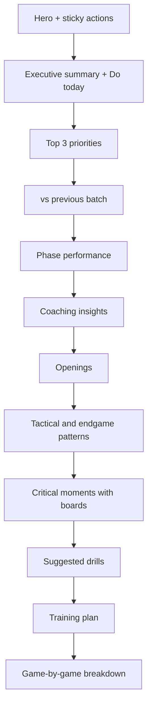

# Batch Report UX Plan

**Status:** Active  
**Scope:** Owner view `/batch-report/:id` (`BatchReport.js` → `BatchReportSections.js`). Shared read-only view reuses the same body with fewer actions.  
**Goal:** Users understand what happened, what to do next, and can find proof in games — without scrolling fatigue or metric confusion.  
**Related:** [PRODUCT_CONTRACT.md](./PRODUCT_CONTRACT.md), [BATCH_ANALYSIS_FLOW.md](./BATCH_ANALYSIS_FLOW.md)

---

## 1. Current state (baseline)

### What works

| Area | Today |
|------|--------|
| Loading | Full-screen overlay, progress bar, ETA, email hint, exit to dashboard / batch analysis |
| Desktop nav | Sticky TOC with scroll-spy (`BatchReportToc.js`) |
| Evidence | FEN boards on critical moments, game accordion with phases + moments |
| Actions | Lichess links in openings, patterns, priorities; share link + PDF |
| Structure | Unified openings, coaching insights cards, color legend |
| Retention | vs previous batch compare when history exists |

### Core problems

1. **Story order** — Turning points and engine stats appear before “so what”; priorities and training plan are buried at the bottom.
2. **Mobile** — TOC hidden below `md`; 10+ sections with no jump nav or sticky actions.
3. **Layout noise** — Nested `Container`s, mixed `py` spacing, chip overload, duplicate legend hints.
4. **Metric trust** — Accuracy + eval stability + phase accuracy compete without a single glossary moment.
5. **Action gaps** — Scroll-to-game has no highlight; compare silently missing on first batch; coaching-unavailable repeated 3×.
6. **Weak above-the-fold** — No report hero, no primary CTA, actions row easy to miss.

### Current section order

```
Actions → Legend → [TOC | Content]
  Failed games (partial only)
  Header stats
  vs previous batch
  Critical moments
  Time management (conditional)
  Executive summary
  Phase breakdown
  Coaching insights (conditional)
  Openings
  Tactical & endgame patterns (conditional)
  Suggested drills
  Top 3 priorities
  4-week training plan
  Game-by-game breakdown
```

---

## 2. Target experience

**User mental model:** *What happened → What to do → Where to practice → Proof in games.*



### Target section order

| # | Section ID | Label (TOC) |
|---|------------|---------------|
| 1 | `batch-section-hero` | *(inline, not in TOC)* |
| 2 | `batch-section-summary` | Executive summary |
| 3 | `batch-section-priorities` | Top priorities |
| 4 | `batch-section-compare` | vs last batch |
| 5 | `batch-section-phases` | Phase breakdown |
| 6 | `batch-section-coaching-insights` | Coaching insights |
| 7 | `batch-section-openings` | Openings |
| 8 | `batch-section-patterns` | Tactical patterns |
| 9 | `batch-section-critical-moments` | Critical moments |
| 10 | `batch-section-drills` | Suggested drills |
| 11 | `batch-section-training` | Training plan |
| 12 | `batch-section-games` | Game breakdown |

Conditional sections stay conditional; TOC builder already filters empty blocks.

---

## 3. Prioritized work packages

### P0 — Trust + narrative (ship first)

| ID | Work | UI / UX | Primary files | Acceptance criteria |
|----|------|---------|---------------|-------------------|
| **P0-1** | Reorder sections | IA | `BatchReportSections.js`, `BatchReportToc.js` | Order matches §2; scroll-spy still correct; conditional sections omitted from TOC when empty |
| **P0-2** | Report hero | UI | New `BatchReportHero.js`, wire in `BatchReportSections.js` | Shows games count, date range, one-line takeaway from executive summary; CTA scrolls to priority #1 |
| **P0-3** | Mobile section nav | UX | New `BatchReportMobileNav.js` or extend `BatchReportToc.js` | Horizontal pill nav on `xs–sm`; same section IDs as desktop; hidden `md+` where desktop TOC shows |
| **P0-4** | Single coaching-missing banner | UX | New `CoachingUnavailableBanner.js`; trim alerts in `ExecutiveSummary.js`, `TopPriorities.js`, `TrainingPlan.js` | At most one info banner when `!coaching_report`; sections show engine data without duplicate alerts |
| **P0-5** | Header metric clarity | UI | `BatchReportHeader.js`, optional tooltip in `BatchReportLegend.js` | Labels: **Move match %** + **Eval stability** with short glossary; phases cross-reference or use consistent naming |
| **P0-6** | Sticky actions (mobile) | UI | `BatchReportActions.js` or wrapper in `BatchReport.js` | Share + PDF remain reachable while scrolling on narrow viewports |

**P0 estimate:** 2–4 dev days  
**P0 outcome:** User sees takeaway and priorities without reading the whole report.

---

### P1 — Clarity + action (second sprint)

| ID | Work | UI / UX | Primary files | Acceptance criteria |
|----|------|---------|---------------|-------------------|
| **P1-1** | Consolidate “Practice next” | UX | New strip component; dedupe `StudyDrillLinks.js` vs `PriorityCard` / `OpeningSection` links | One strip under priorities: priority #1 drill + top 2 unique Lichess URLs |
| **P1-2** | Layout system cleanup | UI | All section components, `ReportSectionShell.js` | One outer `Container` in page shell; sections use shell only; consistent vertical rhythm (`py`) |
| **P1-3** | Game jump highlight | UX | `batchGameLinks.js`, `GameAccordion.js` | `scrollToBatchGame` expands accordion + 2s highlight border on target |
| **P1-4** | Compare empty state | UX | `BatchCompareCard.js` | First batch / 404 shows info card: “Run another batch to track progress” |
| **P1-5** | Reduce chip noise | UI | `GameAccordion.js`, `TopCriticalMoments.js`, `OpeningSection.js` | Accordion summary: label + result + truncated opening; details in expanded body |
| **P1-6** | Partial batch banner | UX | `BatchReportSections.js` or hero | Top alert: “X of Y games · coaching from successful games” + link to failures |
| **P1-7** | Training plan progress | UX | `TrainingPlan.js` | Week items support local “done” state (localStorage per batch id) |
| **P1-8** | TOC completeness | UI | `BatchReportToc.js`, `buildBatchReportTocSections` | TOC includes Compare + Drills when present; mobile pills match |

**P1 estimate:** 3–5 dev days  
**P1 outcome:** Less overwhelm; actions feel connected end-to-end.

---

### P2 — Delight + retention (third sprint)

| ID | Work | UI / UX | Primary files | Acceptance criteria |
|----|------|---------|---------------|-------------------|
| **P2-1** | “Do today” callout | UI | Hero or sticky sub-component | `one_thing_to_do_today` visible without opening executive summary |
| **P2-2** | Executive summary polish | UX | `ExecutiveSummary.js` | Bullets preferred; game refs humanized; readable on mobile |
| **P2-3** | Openings table view | UI | `OpeningSection.js` | Game-by-game rows as compact table (opening, ECO, color, result, link) |
| **P2-4** | Compare skeleton | UI | `BatchCompareCard.js` | No layout jump while compare fetch runs |
| **P2-5** | User regenerate coaching | UX | — | **Not shipped to users** — API + admin only; owner report has no refresh button |
| **P2-6** | PDF / print UX | UX | `printBatchReport.js`, `batchReportPrint.css` | **Download** opens browser print → Save as PDF; html2canvas export removed (too slow / huge files) |
| **P2-7** | Owner “report complete” moment | UI | `BatchReportHero.js` | Light celebratory state aligned with shared report banner tone |

**P2 estimate:** 4–6 dev days  
**P2 outcome:** Report feels finished and worth returning to.

---

### P3 — Later / moat (backlog)

| ID | Work | Notes |
|----|------|-------|
| P3-1 | FEN on priority cards | Reuse `FenBoardImage` when priority cites a position |
| P3-2 | Game accordion expand/collapse all | Needed at 15–30 games |
| P3-3 | Section feedback (“helpful?”) | Coaching quality signal |
| P3-4 | First-visit coach tip | One-time tooltip: start with priorities |
| P3-5 | Deep links (`#batch-section-priorities`) | Shareable section URLs |
| P3-6 | A11y pass | FEN alt text, TOC focus order, 44px touch targets |

---

## 4. Quick wins (≤ 1 day, any sprint)

Can ship independently before full P0:

1. Reorder sections in `BatchReportSections.js` only.
2. One `CoachingUnavailableBanner` — remove duplicate alerts.
3. Compare empty-state copy on 404.
4. Mobile horizontal TOC (reuse `buildBatchReportTocSections`).
5. Accordion highlight on `scrollToBatchGame`.

---

## 5. Explicit non-goals (this plan)

- Rewriting batch report from MUI → Tailwind
- New AI sections or longer coaching JSON
- Client-side html2canvas PDF capture (removed from owner UI; print-to-PDF only)
- Backend metric unification (batch vs single-game analysis)
- Custom domain / email template work (separate ops track)

---

## 6. Sprint schedule (recommended)

| Sprint | Package | Exit criteria |
|--------|---------|---------------|
| **A** | P0-1, P0-2, P0-4, P0-5 | New order live; hero + single coaching banner; header labels clear |
| **B** | P0-3, P0-6, P1-4, P1-6 | Mobile nav + sticky actions; partial + first-batch states handled |
| **C** | P1-1, P1-2, P1-3, P1-5 | Practice strip; layout cleanup; jump highlight; lighter chips |
| **D** | P2-* | Pick by smoke feedback after A–C deploy |

---

## 7. Test plan (per sprint)

| Check | How |
|-------|-----|
| Section order | Manual: scroll report; TOC order matches §2 |
| Mobile | 375px viewport: pill nav works; actions reachable |
| Partial batch | Fixture with `status: partial` + `failed_games` |
| No coaching | `coaching_report: null` — one banner, engine sections visible |
| First batch | Compare shows empty state, not blank gap |
| Game jump | Priority “View game” scrolls + highlights accordion |
| Download | **Download** opens print dialog (Save as PDF); nav/actions hidden via print CSS |
| Share | Copy share link still works |
| Regression | `BatchAnalysisResults.test.js`, batch component tests, visual smoke on batch 9+ |

---

## 8. Success metrics (post-deploy)

| Metric | Target |
|--------|--------|
| Scroll depth to priorities | Median user reaches priorities without scrolling past 70% of report height |
| CTA usage | Track hero “Start with priority #1” clicks (if instrumented) |
| Mobile bounce | Lower exit rate on `/batch-report/*` on mobile |
| Support tickets | Fewer “what should I do?” / “numbers don’t match” questions |
| Return batches | Compare card empty state → second batch within 14 days (qualitative first) |

---

## 9. File map (implementation reference)

| Component | Role |
|-----------|------|
| `BatchReport.js` | Poll, load, actions wrapper, error states |
| `BatchReportSections.js` | Section order + layout grid |
| `BatchReportToc.js` | Desktop TOC + `buildBatchReportTocSections` |
| `BatchReportHeader.js` | Aggregate stats |
| `BatchReportActions.js` | Share, PDF |
| `BatchReportHero.js` | *(new)* Above-the-fold summary |
| `BatchReportMobileNav.js` | *(new)* Mobile pills |
| `CoachingUnavailableBanner.js` | *(new)* Single degraded-coaching message |
| `ExecutiveSummary.js` | Coaching narrative opener |
| `TopPriorities.js` / `PriorityCard.js` | Action items |
| `BatchCompareCard.js` | Progress vs previous |
| `TopCriticalMoments.js` | FEN turning points |
| `GameAccordion.js` | Per-game proof |
| `StudyDrillLinks.js` | Lichess drill grid |

---

## 10. Decision log

| Date | Decision |
|------|----------|
| 2026-06-01 | Priorities move above critical moments; games stay last as proof layer |
| 2026-06-01 | Mobile gets pill nav instead of hiding TOC entirely |
| 2026-06-01 | One coaching-missing banner; no repeated section alerts |
| 2026-06-01 | Defer MUI→Tailwind and PDF engine swap |
| 2026-06-01 | **Sprint A shipped:** P0-1 section reorder, P0-2 hero, P0-4 coaching banner, P0-5 metric labels |
| 2026-06-01 | **Sprint B shipped:** P0-3 mobile pill nav, P0-6 sticky actions, P1-4 compare empty state, P1-6 partial batch banner |
| 2026-06-01 | **Sprint C shipped:** P1-1 practice strip, P1-2 layout cleanup, P1-3 game jump highlight, P1-5 chip diet |
| 2026-06-01 | **Sprint D shipped:** P2-1 do-today hero, P2-2 summary polish, P2-3 openings table, P2-4 compare skeleton, P2-6 download-via-print, P2-7 report-complete hero |
| 2026-06-01 | **Smoke follow-up:** No user-facing coaching regenerate; Download = print-to-PDF only; compare narrative uses “move match”; openings table drops duplicate opening title |
| 2026-06-01 | **Time management section:** Hidden when every analyzed game already has per-game clock stats in the game accordion (batch banner would duplicate) |

---

## 11. Smoke sign-off notes (June 2026)

**Verified on a 10-game completed batch with coaching + prior batch compare:**

| Area | Status |
|------|--------|
| Section order (hero → … → games) | Pass |
| Desktop TOC + scroll-spy | Pass |
| Priorities + Practice next dedupe | Pass |
| Hero Do today + takeaway | Pass |
| Header Move match % / Eval stability | Pass |
| Phase breakdown labels | Pass |
| Openings table + gaps | Pass (opening name deduped in table cell) |
| Patterns, critical moments, training, games | Pass |
| Compare vs #N | Pass — narrative now says **move match** (not “accuracy”) |
| Time management | **Not shown** — expected when all games have clock data in accordions |
| More suggested drills | **Not shown** — expected when all Lichess links fit in Practice next |
| Download | **Download** → print dialog → Save as PDF (no silent auto-save; browser security) |
| Coaching regenerate | **Not exposed** to owners (admin/API only) |

**Known limitations**

- Browsers cannot save a PDF without the print dialog — there is no silent “download PDF” in a web app.
- Client-side html2canvas PDF export is **deprecated** (~150MB, slow); do not re-enable for owners.
- Compare TOC entry: optional; on-page compare block is sufficient for smoke.

---

*Last updated: June 2026*
