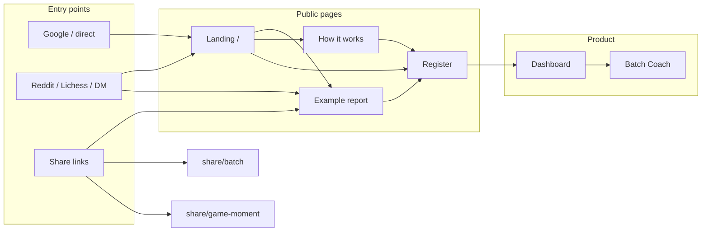

# Landing, SEO & Organic Marketing Audit

**Status:** Active backlog + audit  
**Created:** 2026-06-08  
**Audience:** Product, engineering, growth — pre- and post–soft launch  
**Purpose:** Track landing improvements and document SEO/explorability/organic marketing gaps with prioritized fixes.

**Related:** [LAUNCH_WEEK_PLAN.md](LAUNCH_WEEK_PLAN.md), [PLATFORM_GROWTH_AUDIT.md](PLATFORM_GROWTH_AUDIT.md) (G-01…G-04 overlap), [DIFFERENTIATION_MATRIX.md](DIFFERENTIATION_MATRIX.md), [SINGLE_GAME_RETENTION_PLAN.md](SINGLE_GAME_RETENTION_PLAN.md) (SRG-29 share OG)

---

## 1. Landing page improvements backlog

Items from the 2026-06 landing refresh. **Done** = shipped in code; **Pending** = recommended next.

| ID | Item | Status | Effort | Notes |
|----|------|--------|--------|-------|
| L-01 | Sync demo fixture with current batch report schema (`estimated_study_hours`, `win_loss_draw`, eval stability, etc.) | **Done** | S | `frontend/src/content/demoBatchReport.js` |
| L-02 | Expand landing preview tabs (Overview / Priority / Insights / Plan) | **Done** | S | `BatchReportPreview.js` — uses real report section components |
| L-03 | Marketing hero label (“Example Batch Coach report” vs “Your report”) | **Done** | S | `BatchReportHero` `marketingMode` |
| L-04 | Fix misleading credit math on landing (“import N games — Batch Coach included”) | **Done** | S | `LandingPage.js` |
| L-05 | Remove false “move 18 drill-down” promise on static demo | **Done** | S | CTA now points to full example without implying working deep review |
| L-06 | Wire live demo via `DEMO_BATCH_SHARE_TOKEN` on EB | **Pending** | S | `useExampleBatchReport.js` already supports API fallback; set token to a real shared batch |
| L-07 | Add **Practice next** strip to landing preview (Lichess puzzle links) | **Pending** | S | Demo data supports `collectPracticeNextLinks`; not shown in preview tabs |
| L-08 | Hero screenshot or 15–30s screen recording (import → batch → priority #1) | **Pending** | M | Faster comprehension for cold traffic; good for Reddit/Lichess forum embeds |
| L-09 | Fix **How it works** opener (“A friend shared…”) for direct `/` traffic | **Pending** | S | `BatchCoachHowItWorks.js` — share-link framing is wrong for SEO/landing visitors |
| L-10 | Fix **How it works** credit line (same bug landing had: `signupBonus / 10`) | **Pending** | S | `BatchCoachHowItWorks.js` still uses `sampleReports = floor(signupBonus / 10)` |
| L-11 | Beta badge refresh (“Free beta — 15 credits on signup”) | **Pending** | S | `LandingPage.js` still says “Beta — now open at chess-mate.online” |
| L-12 | Referral mention on landing (+5 both sides after first batch) | **Pending** | S | Only on `/credits` today; low-cost trust + viral hook |
| L-13 | Social proof line when metrics exist (“N batches completed”) | **Pending** | M | Needs `launch_metrics` or lightweight public counter — defer until ≥10 real batches |
| L-14 | Micro-FAQ on landing (anti-positioning) | **Pending** | S | e.g. “Do I still need Chess.com?” → “Yes — we import your games.” (see G-02 in growth audit) |
| L-15 | Trim `/example/batch-report` to “wow path” above the fold | **Pending** | M | Full 12-section scroll is accurate but long for first-time visitors (G-01) |

### Key files

| Surface | Path |
|---------|------|
| Landing | `chess_mate/frontend/src/components/LandingPage.js` |
| Preview | `chess_mate/frontend/src/components/marketing/BatchReportPreview.js` |
| Full example | `chess_mate/frontend/src/components/marketing/ExampleBatchReportPage.js` |
| Demo data | `chess_mate/frontend/src/content/demoBatchReport.js` |
| How-it-works | `chess_mate/frontend/src/components/BatchCoachHowItWorks.js` |
| Live demo token | EB `DEMO_BATCH_SHARE_TOKEN` → `GET /api/v1/public/site-config/` |

---

## 2. Public marketing surface inventory

### Indexable / marketing routes (SPA)

| URL | Component | `usePageMeta` | Purpose |
|-----|-----------|---------------|---------|
| `/` | `LandingPage` | Yes (`PAGE_META.landing`) | Primary acquisition |
| `/example/batch-report` | `ExampleBatchReportPage` | Yes | Full demo report |
| `/how-batch-coach-works` | `BatchCoachHowItWorks` | Yes | Education + conversion |
| `/terms` | `TermsPage` | No | Legal trust |
| `/privacy` | `PrivacyPage` | No | Legal trust |
| `/register?ref=…` | `Register` | No | Referral acquisition |
| `/share/batch/:token` | `BatchSharedReport` | No (client-only) | Viral loop — user-shared |
| `/share/game-moment/:token` | `SharedGameMomentPage` | Yes (client) + server OG | Viral loop — moment shares |

### Not marketing (noindex candidates)

Login, dashboard, batch-report owner views, profile, credits checkout — authenticated product surfaces. Consider `noindex` via meta or `robots.txt` if they ever become crawlable without auth (today mostly behind login).

### Footer / internal links

`SiteFooter` → Support (from `SUPPORT_EMAIL`), Terms, Privacy. No sitemap link, no blog, no FAQ page.

---

## 3. SEO audit

### 3.1 Technical SEO

| Check | Status | Detail |
|-------|--------|--------|
| HTTPS + HSTS | **Pass** | `nginx/chessmate.conf` — redirect HTTP→HTTPS, HSTS header |
| `robots.txt` | **Partial** | `frontend/public/robots.txt` — allows all; **no `Sitemap:` line** |
| XML sitemap | **Missing** | No `sitemap.xml` in `public/` or nginx |
| Canonical URLs | **Partial** | Client-side via `pageMeta.js` on 3 marketing routes only |
| SPA crawlability | **Weak** | Most URLs serve `index.html`; crawlers see generic `index.html` meta until JS runs |
| Server-rendered OG (share moments) | **Pass** | `share_preview.py` + nginx route for `/share/game-moment/{uuid}/` — title, description, **og:image** |
| Server-rendered OG (landing, example, batch share) | **Fail** | No prerender; crawlers that don’t execute JS get stale `index.html` description |
| `www` vs apex | **Verify** | Both hostnames in nginx/SSL; ensure one canonical host (recommend `www.chess-mate.online`) |
| Page speed / Core Web Vitals | **Not audited** | React SPA + batch preview MUI; run Lighthouse on `/` before paid traffic |
| Structured data (JSON-LD) | **Missing** | No `SoftwareApplication`, `FAQPage`, or `Organization` schema |
| PWA manifest | **Present** | `manifest.json` — helps install, not SEO directly |

### 3.2 On-page SEO (marketing pages)

| Page | Title / description | Gap |
|------|---------------------|-----|
| `/` | Set via `PAGE_META.landing` — good coach positioning | No `og:image` in `setPageMeta`; link previews show generic or no image |
| `/example/batch-report` | Dedicated meta — mentions priorities, training plan | Same — no image; long page may hurt engagement signals |
| `/how-batch-coach-works` | Dedicated meta | Share-link opener copy hurts relevance for organic “how batch coach works” queries |
| `/terms`, `/privacy` | Default `index.html` only until… never updated | Legal pages invisible to structured SEO; low priority |
| `index.html` fallback | “Chess Mate” + generic description | **Drift** from `pageMeta.js` — crawlers without JS see wrong copy |

**Recommendation:** Add `og:image` (use `chessmate-og.png` already in `public/`) to `setPageMeta` for all `PAGE_META` entries.

### 3.3 Social / link preview (OG & Twitter)

| URL type | og:title | og:description | og:image | Crawler notes |
|----------|----------|----------------|----------|---------------|
| `/share/game-moment/:token` | Server | Server | Server (`chessmate-og.png`) | **Best** — Discord/iMessage/Slack |
| `/share/batch/:token` | Client only | Client only | None | Batch share links look bare in chat apps |
| `/`, `/example/…`, `/how-…` | Client only | Client only | None | Reddit/Twitter/Facebook previews weak |
| Register referral links | Client only | None | None | Low priority |

### 3.4 Content & keyword strategy (organic search)

**Category to own:** “batch chess analysis,” “chess coaching report,” “analyze multiple chess games,” “lichess chess.com pattern analysis.”

| Asset | SEO value today | Opportunity |
|-------|-----------------|-------------|
| Landing H1 | Strong intent (“Your recent games. One coaching report.”) | Add H2 FAQ block for long-tail queries |
| Example report page | Indexable coach demo | Add 2–3 sentences of static HTML in `index.html` or prerender intro for crawlers |
| How-it-works | Secondary | Fix opener; add comparison table vs single-game analysis |
| Blog / changelog public | **None** | Defer until PMF; one “How I found my Najdorf leak” post could rank |
| Lichess forum / r/chess posts | **Primary organic channel now** | See [LAUNCH_WEEK_PLAN.md §8](LAUNCH_WEEK_PLAN.md) templates |

**Competitor framing (search + landing):** Chess.com/Lichess = free single-game engine. ChessMate = cross-game coach narrative. Say it explicitly once above the fold (G-02).

---

## 4. Explorability & information architecture

### 4.1 Visitor journeys

### 4.2 Gaps

| Gap | Impact |
|-----|--------|
| No HTML sitemap page for humans | Footer only has Terms/Privacy — no “Example report” or “How it works” |
| Example report not linked from navbar for logged-out users | Relies on landing CTAs |
| No `/faq` or `/pricing` public page | Credits/pricing only after signup path |
| Batch share pages lack server OG | Shared reports underperform as viral landing pages |
| `Home.js` exists but is **not routed** | Dead code — ignore |

### 4.3 Recommendations

1. Add logged-out nav links: **Example** · **How it works** · **Sign in** (navbar).
2. Publish `sitemap.xml` with: `/`, `/example/batch-report`, `/how-batch-coach-works`, `/terms`, `/privacy`.
3. Server-side OG for `/share/batch/:token` (mirror `share_preview.py` pattern) — high leverage for referrals.

---

## 5. Organic marketing audit

### 5.1 Channels fit (pre-PMF)

| Channel | Fit | Status | Notes |
|---------|-----|--------|-------|
| Personal DMs / chess friends | **High** | Active | [LAUNCH_WEEK_PLAN.md](LAUNCH_WEEK_PLAN.md) Phase A |
| Referral (`/credits` link, +5/+5) | **High** | Shipped | Not surfaced on landing |
| r/chess, r/chessbeginners | **High** | Template ready | Insight-led post + screenshot; obey sub rules |
| Lichess forum / Discord | **Medium** | Template ready | Same screenshot story |
| Twitter/X chess community | **Medium** | Not started | Share moment links work best after SRG-29 OG |
| Product Hunt | **Low now** | Defer | Wait for second-batch signal + P0-1 |
| Paid ads (Meta/Google) | **Low now** | Defer | Unit economics need volume first ([PRICING_UNIT_ECONOMICS.md](../PRICING_UNIT_ECONOMICS.md)) |
| SEO (cold Google) | **Low short-term** | 3–6 mo | Needs sitemap, OG images, content pages |
| YouTube / TikTok chess creators | **Medium** | Outreach | Offer free credits for 60s demo video |

### 5.2 Viral loops

| Loop | Mechanism | Friction |
|------|-----------|----------|
| Batch share link | User enables share on report | OG not server-rendered — weak preview in chat |
| Game moment share | `/share/game-moment/:token` | **Strong** — server OG + image |
| Referral code | Register `?ref=` | Hidden until credits page |
| PWA install | Mobile prompt after engagement | No landing mention |

### 5.3 Messaging consistency

| Message | Landing | How-it-works | Register | Risk |
|---------|---------|--------------|----------|------|
| 15 free credits | Yes | Yes (wrong math) | Via site-config | How-it-works still says “N batch reports at 10 games” |
| Batch Coach included after import | Yes (fixed) | Yes | — | Aligned |
| First depth-20 review free | Yes | Partial | — | Demo can’t show drill-down without live token |
| Not engine lines — patterns | Yes | Yes | — | Strong |
| Beta | Yes | Yes | — | Consider softer “free beta” framing |

### 5.4 Creative assets needed

| Asset | Use |
|-------|-----|
| Screenshot: priorities card + “Do today” | Reddit, landing hero optional |
| Screenshot: phase breakdown + opening gap | Community posts |
| 60s screen recording | Lichess forum, Twitter, future PH |
| `chessmate-og.png` on all marketing pages | Link previews |
| Anonymized full batch share URL | `DEMO_BATCH_SHARE_TOKEN` for credible example |

---

## 6. Analytics & measurement

| Capability | Status | Gap |
|------------|--------|-----|
| Cloudflare Web Analytics | **On** | `index.html` — page views, no funnel |
| GTM / gtag marketing events | **Shipped** | GA4 `G-3NLTQ3XH2Y` in `index.html` + `marketingAnalytics.js` — see [PRODUCT_ANALYTICS_AUDIT.md](PRODUCT_ANALYTICS_AUDIT.md) |
| Product funnel dashboard | **Partial** | GA4 Realtime + Explorations; DB via `launch_metrics` |
| `launch_metrics` CLI | **Shipped** | EB-only; manual weekly ([LAUNCH_WEEK_PLAN.md §7](LAUNCH_WEEK_PLAN.md)) |
| UTM discipline | **Partial** | `marketingLinks.js` sources on CTAs; community posts manual |
| SEO rank tracking | **Missing** | No Search Console verification documented |
| A/B testing | **None** | Defer |

**Pre-launch analytics minimum:** Google Search Console property for `chess-mate.online`, confirm GTM receives `chessmate_*` events, weekly `launch_metrics` + spreadsheet.

---

## 7. Prioritized action list

### P0 — Before louder marketing (community post, 100+ visitors)

| # | Action | Owner | Effort |
|---|--------|-------|--------|
| 1 | Set `DEMO_BATCH_SHARE_TOKEN` to real shared batch | Ops | S |
| 2 | Add `og:image` to `setPageMeta` (all `PAGE_META` pages) | FE | S |
| 3 | Fix How-it-works opener + credit line (L-09, L-10) | FE | S |
| 4 | Add `sitemap.xml` + `Sitemap:` in `robots.txt` | FE/Ops | S |
| 5 | Pick canonical host (`www` vs apex) and 301 the other consistently | Ops | S |

### P1 — First month organic

| # | Action | Effort |
|---|--------|--------|
| 6 | Server-rendered OG for `/share/batch/:token` | M |
| 7 | Landing micro-FAQ + competitor one-liner (L-14, G-02) | S |
| 8 | Logged-out navbar: Example · How it works | S |
| 9 | Referral mention on landing (L-12) | S |
| 10 | Practice next strip in preview (L-07) | S |
| 11 | Google Search Console + submit sitemap | S |
| 12 | Hero screenshot or short video (L-08) | M |

### P2 — Growth phase

| # | Action | Effort |
|---|--------|--------|
| 13 | Prerender or SSR meta for `/`, `/example/batch-report` | L |
| 14 | Public `/faq` or expandable FAQ on landing | M |
| 15 | JSON-LD `SoftwareApplication` on landing | S |
| 16 | Trim example report to wow-path (L-15) | M |
| 17 | Social proof counter (L-13) | M |
| 18 | `noindex` on auth-only routes if crawl issues appear | S |

---

## 8. Cross-reference to growth audit

| This doc ID | PLATFORM_GROWTH_AUDIT ID | Topic |
|-------------|--------------------------|-------|
| L-15, preview work | G-01 | Hero demo / wow path |
| L-14 | G-02 | Anti-positioning / FAQ |
| §3.3 batch share OG | G-03 (share loop) | Viral previews |
| §6 | G-04 / analytics sections | Funnel blindness |

Do not duplicate financial/unit-economics analysis — see [PLATFORM_GROWTH_AUDIT.md](PLATFORM_GROWTH_AUDIT.md) and [PRICING_UNIT_ECONOMICS.md](../PRICING_UNIT_ECONOMICS.md).

---

## Changelog

| Date | Change |
|------|--------|
| 2026-06-08 | Initial audit — landing backlog (post demo refresh), SEO/explorability/organic marketing |
