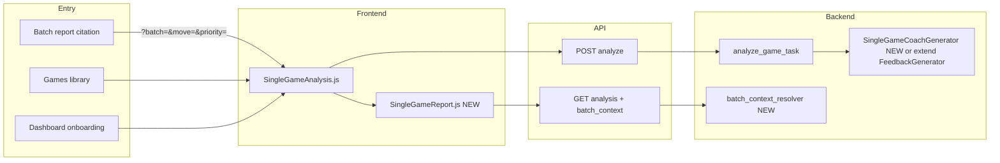
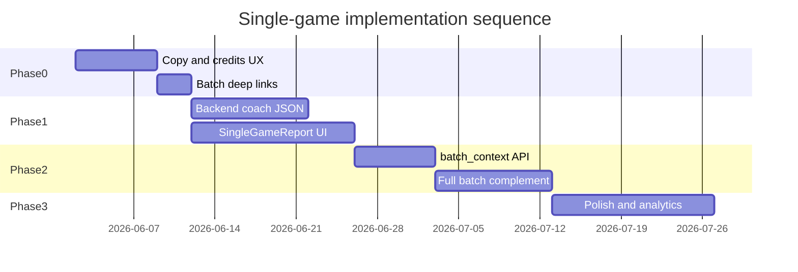

# Single-Game Analysis — Implementation Plan

**Status:** Phase 2 complete — ready for smoke test (2026-06-01)  
**Date:** 2026-06-01  
**Scope:** Supplementary drill-down at `/game/:gameId/analysis` — batch-connected, coaching-oriented, better than free per-game tools without competing with Batch Coach as the flagship.  
**Related:** [PRODUCT_CONTRACT.md](./PRODUCT_CONTRACT.md), [DIFFERENTIATION_MATRIX.md](./DIFFERENTIATION_MATRIX.md), [BATCH_REPORT_UX_PLAN.md](./BATCH_REPORT_UX_PLAN.md), [PRD.md](./PRD.md)

---

## 1. Goals & non-goals

### Goals

| # | Goal | Done when |
|---|------|-----------|
| G1 | Single-game is clearly **supplementary** to Batch Coach | Copy, dashboard funnel, and nav reflect batch-first; single-game never hero on landing |
| G2 | **Batch-connected drill-down** | >50% of single-game sessions originate from batch citations (measure post-launch) |
| G3 | Beat Chess.com/Lichess on **coaching proof**, not engine breadth | Board + eval + cited moments + one actionable drill + batch link |
| G4 | **Trust** in metrics and credits | Credit cost visible before analyze; classification disclaimer when batch differs |
| G5 | One results path | `GameFeedback.js` retired or merged; no duplicate legacy APIs in UI |

### Non-goals (this plan)

- Full opening explorer / Lichess DB parity  
- Unlimited free single-game analysis  
- Second flagship report rivaling batch TOC / priorities / 4-week plan  
- Social features, live OTB analysis  
- Replacing batch cross-game pattern detection  
- Depth arms race (stay depth-20 single, depth-14 batch — label both)

---

## 2. Current baseline (repository truth)

### Routes & entry points

| Entry | Path / component | Notes |
|-------|------------------|-------|
| Primary route | `/game/:gameId/analysis` → `SingleGameAnalysis.js` | Poll + render `GameAnalysisResults.js` |
| Games CTA | `Games.js` → `handleAnalyzeGame` | No credit confirm; navigates immediately |
| Batch citations | `TopCriticalMoments.js`, `GameAccordion.js` | Link to `/game/${saved_game_id}/analysis` — no `?move=` or `?batch=` |
| Dashboard | `dashboardFocus.js` | Suggests analyze 5 games before batch (incorrect — batch runs Stockfish on import) |
| Orphan UI | `GameFeedback.js` | Eval chart + tabs; uses `fetchGameFeedback`; **not routed** |

### Backend pipeline

```
POST /api/v1/games/{id}/analyze/  → analyze_game (game_views.py)
  → credit check (1) + deduct upfront
  → analyze_game_task (depth=20, use_ai=True)
  → GameAnalyzer → StockfishAnalyzer → MetricsCalculator → FeedbackGenerator (gpt-3.5-turbo)

GET /api/v1/games/{id}/analysis/  → get_game_analysis
  → GameAnalysis.analysis_data + feedback + minimal game_context
```

**Gaps vs target:**

- No `batch_id`, `priority_index`, or `move` query support on GET  
- `GameViewSet.analyze` bypasses credits (DRF action)  
- Credits charged on enqueue, not on success — no refund on hard fail (batch has `_refund_failed_batch_credits`)  
- `training_block` generated in `feedback_generator.py` but not rendered  
- `game_context` missing platform, date, player_color, opponent

### Reusable frontend assets

| Asset | Location | Reuse in single-game |
|-------|----------|----------------------|
| FEN boards + arrows | `batch/FenBoardImage.js`, `utils/fenBoardSvg.js` | Critical moments, main board (Phase 1) |
| Section chrome | `batch/ReportSectionShell.js` | All report sections |
| Lichess drill CTA | `batch/LichessActionButton.js`, `utils/lichessStudyLinks.js` | Worst-moment drill |
| Platform badge | `GamePlatformBadge.js`, `utils/gamePlatform.js` | Game header |
| Opening resolution | `utils/openingInsights.js`, `openingNameCompact.js` | Header + drill target |
| Eval chart pattern | `GameFeedback.js` (chart.js) | Extract to shared component |
| Loading tone | `batch/BatchLoadingScreen.js` | Align copy + layout |

### Dependency note: interactive board

`package.json` has **no** `chess.js` / `react-chessboard`. Phase 1 uses **FEN-per-move** from analysis payload + `FenBoardImage` + synced move list (no new npm dep). Phase 2 optionally adds `chess.js` if scrubbing/annotations need full move legality.

---

## 3. Target architecture



### Target page component tree

```
SingleGameAnalysis.js          # loading / polling / errors only
└── SingleGameReport.js        # all results UI (replaces GameAnalysisResults.js)
    ├── SingleGameHeader.js
    ├── BatchContextBanner.js  # conditional
    ├── SingleGameHero.js      # takeaway + do_today
    ├── SingleGameBoardPanel.js
    │   ├── FenBoardImage
    │   ├── EvalChart.js       # extracted from GameFeedback
    │   └── MoveList.js
    ├── CriticalMomentsSection.js  # reuse batch card pattern
    ├── PhaseStrip.js
    ├── CoachingSection.js
    ├── TrainingBlockSection.js
    ├── MoveTableAccordion.js    # power users
    └── SingleGameFooterCta.js
```

---

## 4. API contract changes

### 4.1 POST `/api/v1/games/{id}/analyze/`

**Request body (add optional fields):**

```json
{
  "force_reanalyze": false,
  "from_batch": false,
  "batch_id": null
}
```

| Field | Behavior |
|-------|----------|
| `from_batch` + `batch_id` | **Phase 2:** skip credit charge when opened from batch citation (configurable via `SINGLE_GAME_FREE_FROM_BATCH`) |
| `force_reanalyze` | Default `false` when analysis exists; `true` only on explicit re-analyze button |

**Response (add):**

```json
{
  "credits_charged": 1,
  "credits_remaining": 4,
  "analysis_depth": 20
}
```

### 4.2 GET `/api/v1/games/{id}/analysis/`

**Query params:**

| Param | Purpose |
|-------|---------|
| `batch_id` | Attach batch context for banner + moment alignment |
| `move` | Initial selected ply (1-based half-move index) |

**Response extensions:**

```json
{
  "game_context": {
    "id": 42,
    "white": "...",
    "black": "...",
    "opponent": "...",
    "player_color": "white",
    "result": "loss",
    "opening_name": "...",
    "eco": "B90",
    "platform": "lichess",
    "platform_game_url": "...",
    "date_played": "2026-05-01"
  },
  "batch_context": {
    "batch_id": 7,
    "priority_index": 1,
    "priority_title": "...",
    "recurring_pattern": "hanging_piece",
    "batch_opening_record": "0W-2L",
    "linked_moment": { "move_number": 18, "fen": "...", "type": "blunder" }
  },
  "coaching": {
    "takeaway": "...",
    "do_today": "...",
    "critical_moments": [],
    "phase_notes": {},
    "training_block": {}
  },
  "engine_meta": {
    "depth": 20,
    "classification_note": "Single-game uses depth-20 coach model; batch report uses depth-14."
  }
}
```

**Implementation:** `get_game_analysis` calls new `resolve_batch_context_for_game(user, game_id, batch_id, move)` in `core/analysis/single_game_context.py`; merges batch moment when `saved_game_id` matches.

### 4.3 Structured AI output (backend)

Extend `FeedbackGenerator` or add `SingleGameCoachGenerator` (`core/analysis/single_game_coach_generator.py`):

| Field | Source |
|-------|--------|
| `takeaway` | AI, 1 sentence |
| `do_today` | AI, 1 action |
| `critical_moments[]` | Engine top 3 swings + AI explanation |
| `phase_notes` | AI per opening/middlegame/endgame |
| `training_block` | Existing `_build_training_block` + Lichess drill URL |

**Model:** `gpt-4o-mini` (align with `coaching_generator.py`).  
**Prompt input:** trimmed moves (worst 10 + phase summaries), `game_context`, optional `batch_context` snippet — never invent stats.

### 4.4 Credit integrity

| Ticket | Change |
|--------|--------|
| SGA-BE-04 | Add credits + abuse checks to `GameViewSet.analyze` OR deprecate route and return 410 |
| SGA-BE-05 | Charge on task **success** (or refund on hard fail) — mirror `refund_batch_credits_on_hard_fail` pattern in `core/single_game_credits.py` |
| SGA-BE-06 | Return `402` with `credits_required` / `credits_available` consistently (Games + SingleGameAnalysis handle) |

---

## 5. Phased implementation

### Phase 0 — Clarify place (1 sprint, ~8 tickets)

**Outcome:** Users understand single-game is optional drill-down; batch funnel is honest; minimal UI wins.

| ID | Ticket | Files | Acceptance |
|----|--------|-------|------------|
| SGA-0-01 | Fix dashboard funnel copy | `dashboardFocus.js`, `stats_helpers.py` (server next_action if used), `Dashboard.js` | When ≥5 games imported, CTA is **Batch Coach**, not “analyze N more games” |
| SGA-0-02 | Welcome guide credit wording | `WelcomeGuide.js`, `Credits.js` | Import = 1 credit/game; batch coach included; single-game = +1 optional |
| SGA-0-03 | Credit confirm on Games analyze | `Games.js`, new `AnalyzeGameConfirmDialog.js` | Modal: “Uses 1 credit · depth-20 coach review”; block on insufficient credits |
| SGA-0-04 | Game header on results | `GameAnalysisResults.js` → later `SingleGameHeader.js`; extend `get_game_analysis` `game_context` | Shows opponent, result, opening, platform badge, date |
| SGA-0-05 | Batch link query params | `TopCriticalMoments.js`, `GameAccordion.js`, `PriorityCard.js` | Links: `/game/{id}/analysis?batch={batchId}&move={n}` |
| SGA-0-06 | Batch banner (read URL params) | `SingleGameAnalysis.js`, new `BatchContextBanner.js` | When `batch` in URL, fetch batch summary slice client-side or via new GET param; show “Priority #N” stub even before BE batch_context |
| SGA-0-07 | Footer CTAs | `GameAnalysisResults.js` | “View batch report” / “Start Batch Coach” when user has batches |
| SGA-0-08 | Loading copy cleanup | `SingleGameAnalysis.js` | Remove debug `progress state:` strings; match batch loading tone |
| SGA-0-09 | Marketing one-liner | `LandingPage.js`, `HowItWorks` (if exists), `pageMeta.js` | One subordinate line under batch hero only |
| SGA-0-10 | Tests | `dashboardFocus.test.js`, `Games.test.js`, `SingleGameAnalysis.test.js` | All pass; new cases for credit modal + batch query |

**Phase 0 exit criteria:** No user-facing message implies batch requires 5 pre-analyzed single-games; credit cost visible before analyze.

---

### Phase 1 — “Better than default” MVP (2–3 sprints, ~14 tickets)

**Outcome:** Board + eval + moments + coaching hero; gpt-4o-mini structured output; one drill link.

#### Backend

| ID | Ticket | Files | Acceptance |
|----|--------|-------|------------|
| SGA-1-BE-01 | Rich `game_context` on GET | `game_views.py` `get_game_analysis`, `GameSerializer` fields | Full header fields populated |
| SGA-1-BE-02 | `SingleGameCoachGenerator` | New `core/analysis/single_game_coach_generator.py`; wire in `game_analyzer.py` | JSON schema validated; stored in `GameAnalysis.feedback` |
| SGA-1-BE-03 | Upgrade model to gpt-4o-mini | `feedback_generator.py` or new generator; `settings.py` | Configurable `SINGLE_GAME_COACH_MODEL` |
| SGA-1-BE-04 | Expose `coaching` + `engine_meta` on GET | `get_game_analysis` | Frontend reads stable shape |
| SGA-1-BE-05 | Critical moments in single-game payload | `stockfish_analyzer.py` or post-process in `GameAnalyzer` | Top 3 swings with fen, played/best UCI, eval_swing |
| SGA-1-BE-06 | Credit refund on hard fail | `tasks.py` `analyze_game_task`, `single_game_credits.py` | Failed analysis refunds 1 credit when charge was applied |

#### Frontend

| ID | Ticket | Files | Acceptance |
|----|--------|-------|------------|
| SGA-1-FE-01 | Create `SingleGameReport.js` | New; migrate from `GameAnalysisResults.js` | `SingleGameAnalysis.js` renders only loading/error/report shell |
| SGA-1-FE-02 | Extract `EvalChart.js` | From `GameFeedback.js`; shared `components/analysis/EvalChart.js` | Chart renders from `moves[].evaluation` |
| SGA-1-FE-03 | `SingleGameBoardPanel` | `FenBoardImage` + move list sync | Click move → board FEN updates; orientation from player_color |
| SGA-1-FE-04 | `CriticalMomentsSection` | Adapt `TopCriticalMoments` card layout (single-game, no batch scroll) | Top 3 moments with boards |
| SGA-1-FE-05 | Hero takeaway + do today | `SingleGameHero.js` | Renders `coaching.takeaway`, `coaching.do_today` |
| SGA-1-FE-06 | Classification disclaimer | Small `EngineMetaNote.js` | Shows depth-20 vs batch depth-14 note |
| SGA-1-FE-07 | Lichess drill on worst moment | `LichessActionButton` + `lichessStudyLinks.js` | One CTA from opening/moment context |
| SGA-1-FE-08 | Move table accordion | Collapsed by default on mobile | Full move table preserved for power users |
| SGA-1-FE-09 | Retire `GameFeedback.js` from bundle | Delete or archive; remove dead imports in `apiRequests.js` if unused | ESLint clean; no duplicate fetch paths |
| SGA-1-FE-10 | Tests | `SingleGameReport.test.js`, `EvalChart.test.js`, `test_single_game_coach_generator.py` | Board sync, hero, moments, API shape |

**Phase 1 exit criteria:** User from batch citation sees board, eval graph, 3 moment cards, takeaway, drill link, batch footer CTA.

---

### Phase 2 — Deep batch complement (2 sprints, ~10 tickets)

**Outcome:** Server-side batch context; deep links; pattern tags; optional free-from-batch credits.

| ID | Ticket | Files | Acceptance |
|----|--------|-------|------------|
| SGA-2-BE-01 | `resolve_batch_context_for_game` | `core/analysis/single_game_context.py` | GET `?batch_id=` returns `batch_context` |
| SGA-2-BE-02 | Align linked moment with batch | When batch moment exists for move, prefer batch fen/classification in UI | Disclaimer if single-game engine disagrees |
| SGA-2-BE-03 | `from_batch` credit waiver | `analyze_game`, `settings.SINGLE_GAME_FREE_FROM_BATCH` | Citation analyze costs 0 when enabled |
| SGA-2-BE-04 | Pass `batch_context` into AI prompt | `SingleGameCoachGenerator` | Takeaway references batch priority when present |
| SGA-2-FE-01 | `BatchContextBanner` full | Priority title, pattern chip, opening record | Uses API `batch_context` |
| SGA-2-FE-02 | Initial move from `?move=` | `SingleGameBoardPanel` | Loads cited ply on mount |
| SGA-2-FE-03 | `PhaseStrip` | Reuse batch phase chip styles | Opening / MG / EG scores + one-line note |
| SGA-2-FE-04 | `TrainingBlockSection` | Surface `training_block` from API | Phase motifs + impact metrics |
| SGA-2-FE-05 | Best-move arrow on board | Extend `FenBoardImage` usage with `bestMoveUci` on selected move | Arrow on scrubbed position |
| SGA-2-FE-06 | Example on landing | `ExampleBatchReportPage.js` or `BatchReportPreview.js` | “Open this moment” links to demo single-game or static preview |
| SGA-2-FE-07 | Tests | Integration test batch link → single-game banner | E2E or RTL with mocked batch GET |

**Phase 2 exit criteria:** Batch → single-game path shows priority banner, lands on cited move, optional zero-credit from batch.

---

### Phase 3 — Platform polish (ongoing, ~8 tickets)

| ID | Ticket | Files | Acceptance |
|----|--------|-------|------------|
| SGA-3-01 | Re-analyze flow | `SingleGameAnalysis.js` | Explicit button; `force_reanalyze=true`; confirm 1 credit |
| SGA-3-02 | Share read-only moment link | New `SharedGameMomentPage.js` + backend token (optional) | Lightweight share like batch share |
| SGA-3-03 | Email nudge | Celery task post-batch | “Review your worst moment” with deep link |
| SGA-3-04 | Mobile sticky move chips | `SingleGameBoardPanel` | Horizontal scroll moment chips |
| SGA-3-05 | PDF one-game summary | Reuse `batchReportPrint.css` patterns | Export hero + moments |
| SGA-3-06 | Analytics events | `marketingAnalytics.js` | `single_game_view`, `single_game_from_batch`, `single_game_drill_click` |
| SGA-3-07 | Deprecate legacy analyze paths | `api/requests.js`, `GameViewSet.analyze` | 410 or unified path only |
| SGA-3-08 | First single-game free onboarding | `Profile` flag + `analyze_game` waiver | One-time free analysis after signup (product flag) |

---

## 6. File change map (summary)

### New files

| Path | Phase |
|------|-------|
| `docs/product/SINGLE_GAME_ANALYSIS_IMPLEMENTATION_PLAN.md` | — |
| `frontend/src/components/singlegame/SingleGameReport.js` | 1 |
| `frontend/src/components/singlegame/SingleGameHeader.js` | 0–1 |
| `frontend/src/components/singlegame/BatchContextBanner.js` | 0–2 |
| `frontend/src/components/singlegame/SingleGameHero.js` | 1 |
| `frontend/src/components/singlegame/SingleGameBoardPanel.js` | 1 |
| `frontend/src/components/singlegame/CriticalMomentsSection.js` | 1 |
| `frontend/src/components/singlegame/SingleGameFooterCta.js` | 0 |
| `frontend/src/components/singlegame/EngineMetaNote.js` | 1 |
| `frontend/src/components/analysis/EvalChart.js` | 1 |
| `frontend/src/components/AnalyzeGameConfirmDialog.js` | 0 |
| `core/analysis/single_game_coach_generator.py` | 1 |
| `core/analysis/single_game_context.py` | 2 |
| `core/single_game_credits.py` | 1 |

### Modify

| Path | Phases |
|------|--------|
| `SingleGameAnalysis.js` | 0, 1 |
| `GameAnalysisResults.js` | 0 → deprecate after 1 |
| `Games.js` | 0 |
| `dashboardFocus.js`, `Dashboard.js` | 0 |
| `TopCriticalMoments.js`, `GameAccordion.js`, `PriorityCard.js` | 0, 2 |
| `game_views.py` | 1, 2 |
| `game_analyzer.py`, `tasks.py` | 1 |
| `feedback_generator.py` | 1 (or thin wrapper) |
| `LandingPage.js`, `Credits.js`, `WelcomeGuide.js` | 0 |
| `gameAnalysisService.js` | 1, 2 (query params, normalize coaching) |

### Delete / archive

| Path | Phase |
|------|-------|
| `GameFeedback.js`, `GameFeedback.css` | 1 (after extraction) |
| Dead `fetchGameFeedback` in `api/requests.js` if unused | 1 |

---

## 7. Test plan

### Backend (`pytest`)

| Area | Tests |
|------|-------|
| `get_game_analysis` | Rich `game_context`; `batch_context` with `batch_id`; 404/no analysis |
| `analyze_game` | Credits deduct/refund; `from_batch` waiver; abuse limit |
| `SingleGameCoachGenerator` | Schema validation; no hallucinated move numbers; batch snippet in prompt |
| `single_game_context` | Maps `saved_game_id` + move to batch moment |
| Regression | `test_game_analysis.py`, `test_analysis_tasks.py` stay green |

### Frontend (`jest`)

| Area | Tests |
|------|-------|
| `dashboardFocus` | ≥5 games → Batch CTA, not “analyze N more” |
| `Games` | Credit modal; insufficient credits error |
| `SingleGameAnalysis` | Poll → report; batch query banner |
| `SingleGameReport` | Header, hero, moments, move sync, footer CTAs |
| `EvalChart` | Renders with mock moves |
| `lichessStudyLinks` | Drill from moment context (reuse existing tests) |

### Manual QA checklist

- [ ] Analyze from Games with 0 credits → clear error, no silent fail  
- [ ] Open from batch critical moment → banner + correct move selected (Phase 2)  
- [ ] Re-analyze does not double-charge when analysis in progress  
- [ ] Dark mode: board, chart, cards readable  
- [ ] Mobile: board stacks above eval; move table collapsed  
- [ ] Classification disclaimer visible when batch + single-game disagree  

---

## 8. Sequencing & dependencies



**Critical path:** Phase 0 batch links → Phase 1 backend coaching shape → Phase 1 `SingleGameReport` → Phase 2 `batch_context`.

**Parallelizable:** Phase 0 marketing copy; Phase 1 `EvalChart` extraction; Phase 1 credit refund backend while FE board panel in progress.

---

## 9. Rollout & feature flags

| Flag | Default | Purpose |
|------|---------|---------|
| `SINGLE_GAME_COACH_V2` | `false` → enable in staging | New generator + UI |
| `SINGLE_GAME_FREE_FROM_BATCH` | `false` | Zero credit from batch citation |
| `SINGLE_GAME_FIRST_FREE` | `false` | Onboarding waiver |

Rollout: staging → internal dogfood → 10% prod → 100% after metrics stable.

---

## 10. Success metrics (30 days post Phase 2)

| Metric | Target |
|--------|--------|
| `single_game_from_batch` / `single_game_view` | > 50% |
| Batch moment → single-game click-through | > 25% of report viewers |
| Single-game → batch within 7d (games-only users) | > 15% |
| Support tickets “unexpected credit charge” | Down vs baseline |
| Median time on page (batch-referred) | > 3 min |

---

## 11. Risks & mitigations

| Risk | Mitigation |
|------|------------|
| Metric mismatch batch vs single-game erodes trust | `EngineMetaNote` + prefer batch moment when linked |
| Upfront credit charge on failure | Refund on hard fail (SGA-1-BE-06) |
| Scope creep into “full analyzer” | Move table collapsed; no opening DB in this plan |
| `GameViewSet.analyze` credit bypass | Deprecate or align in Phase 1 |
| No chess.js → limited interactivity | FEN-per-move sufficient for MVP; add chess.js only if user testing demands |

---

## 12. Suggested sprint breakdown

| Sprint | Deliverables |
|--------|--------------|
| **S1** | Phase 0 complete (tickets SGA-0-01 – SGA-0-10) |
| **S2** | SGA-1-BE-01 – BE-05; SGA-1-FE-01, FE-02, FE-06 |
| **S3** | SGA-1-BE-06; SGA-1-FE-03 – FE-08; retire GameFeedback |
| **S4** | Phase 2 backend + banner + `?move=` + training block |
| **S5** | Phase 2 landing example + Phase 3 analytics + mobile polish |

---

## 13. Open product decisions (resolve before Phase 2)

| # | Question | Options | Recommendation |
|---|----------|---------|----------------|
| D1 | Free single-game when opened from batch? | A) Always 1 credit B) Free from citation C) First free only | **B** via flag — strongest complement story |
| D2 | Re-analyze default | A) `force_reanalyze=true` B) `false` if analysis exists | **B** — show cached results; explicit re-analyze button |
| D3 | Dashboard onboarding single-game | A) Remove entirely B) One “try one game” C) Keep analyze CTA | **B** — one optional taste, then batch |
| D4 | Nav item for single-game | A) None B) Sub-item under Games | **A** — discover via Games + batch only |

---

*This plan is the engineering execution companion to the strategic audit. Update status tickets in Linear/GitHub Issues using IDs `SGA-{phase}-{BE|FE}-{nn}`.*
