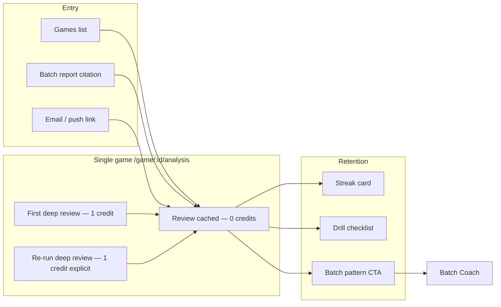
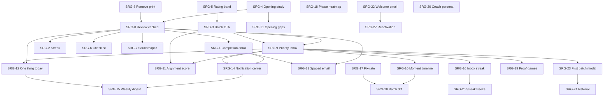

# Single-Game Retention & Batch Bridge Plan

**Status:** 🔒 Locked — **SRG-0…29 shipped** (2026-06-08 audit). Scope frozen; track progress via checkboxes only. Change scope via explicit doc revision (date + rationale).  
**Created:** 2026-06-08  
**Owner:** Product / Engineering  
**Goal:** Make single-game analysis a **free-to-revisit, credit-worthy-first-run** drill-down that pulls users into batch coach, improves retention, and beats Chess.com/Lichess on **coaching proof** — not engine breadth.

**Related:** [SINGLE_GAME_ANALYSIS_IMPLEMENTATION_PLAN.md](./SINGLE_GAME_ANALYSIS_IMPLEMENTATION_PLAN.md), [BATCH_REPORT_UX_PLAN.md](./BATCH_REPORT_UX_PLAN.md), [DIFFERENTIATION_MATRIX.md](./DIFFERENTIATION_MATRIX.md), [PRODUCT_CONTRACT.md](./PRODUCT_CONTRACT.md)

---

## 0. Scope lock

### In scope (this plan)

| ID | Feature |
|----|---------|
| **SRG-0** | Review cached report without spending credits |
| **SRG-1** | Completion email/push with headline + worst-moment deep link |
| **SRG-2** | “You vs engine” blunder-free streak |
| **SRG-3** | Batch pattern CTA on single-game report |
| **SRG-4** | Opening-specific study link (ECO + your mistakes in that opening) |
| **SRG-5** | Rating-band comparison copy (“Players at ~1200 miss this…”) |
| **SRG-6** | 5-minute drill checklist (checkboxes, `localStorage`) |
| **SRG-7** | Move navigation sound/haptic (classification-aware) |
| **SRG-8** | Remove print/PDF from single-game (and align batch print policy separately) |
| **SRG-9** | Priority inbox — batch priorities queue; single-game marks “reviewed” |
| **SRG-10** | “Moment in N batches” timeline across batch runs |
| **SRG-11** | Coach alignment score — batch claim vs single-game confirmation |
| **SRG-12** | Dashboard “one thing today” — worst moment from latest batch or single game |
| **SRG-13** | Spaced-repetition reminder email (7-day, anti-spam hardened) |
| **SRG-14** | In-app notification center (bell — inbox + completions) |
| **SRG-15** | Weekly coach digest email (max 1/week, anti-spam) |
| **SRG-16** | Priority inbox streak (“5 days clearing coach items”) |
| **SRG-17** | Fix-rate score (“You fixed 2/3 patterns from last batch”) |
| **SRG-18** | Win/loss × phase heatmap + example games |
| **SRG-19** | Auto-pick 3 proof games — seed inbox after batch |
| **SRG-20** | Batch A vs B moment diff (swing trend) |
| **SRG-21** | Opening repertoire gap → your lost games |
| **SRG-22** | Welcome + email-confirmation onboarding mail |
| **SRG-23** | Post-first-batch celebration modal |
| **SRG-24** | Referral credits |
| **SRG-25** | Inbox streak freeze (1× per calendar month) |
| **SRG-26** | Coach persona tone (direct vs encouraging) |
| **SRG-27** | Inactive 30-day reactivation email (strict opt-in) |
| **SRG-28** | PWA install prompt (mobile only, after first batch — not on first visit) |
| **SRG-29** | Moment share text preview (OG title/description); image deferred |

### Deferred — not building now

| ID | Idea | Notes |
|----|------|-------|
| **DX-02b** | Moment share **dynamic OG image** (board PNG) | Too expensive for now; ship SRG-29 text first; promote when share/referral volume justifies |
| **DX-03** | Training plan `.ics` calendar export | Deferred — SRG-6 + SRG-12 cover daily habit |
| **OPS-01** | Bounce/complaint auto-pause for spaced email | Requires ESP webhooks / Sentry — not launch-blocking |
| **OPS-02** | Global 500/hour spaced send rate cap | Celery daily batch + provider limits sufficient for launch |

### Out of scope (explicit)

- Print/PDF export for single-game reports  
- New OpenAI calls per game (batch invariant: one OpenAI call per **batch** only; single-game coach stays one call per **first** depth-20 run)  
- Opening DB parity with Lichess/Chess.com  
- Social feed / leaderboards  
- Push infrastructure beyond email + optional Web Push (Phase 2)  
- **Marketing drip campaigns** (5-day nurture sequences, promotional blasts) — separate opt-in only  
- **Multi-email days** — see §3 global email budget; never stack completion + digest + spaced on same day

### Global email budget (all SRG mail)

| Type | Cap | Default |
|------|-----|---------|
| Confirmation (SRG-22) | 1 per signup | Always (transactional) |
| Welcome (SRG-22) | 1 after verify | Always (transactional) |
| Analysis complete — single/batch (SRG-1 + batch existing) | 1 per job | User preference on |
| Weekly digest (SRG-15) | 1 per 7 days | Opt-in off |
| Spaced moment (SRG-13) | 1 per 7 days | Opt-in off; **mutually exclusive** with digest in same week |
| Reactivation (SRG-27) | 1 per 30 days | Opt-in off; only if no login + no batch in 30d |

**Rule:** Per user, max **2 coaching emails in any 7-day window** (excluding confirmation/welcome/reactivation). Implementation: shared `EmailSendLog` checked by all senders.

---

## 1. Problem statement

Today users experience:

1. **Re-opening a analyzed game feels like a new paid run** — `SingleGameAnalysis.js` mounts → `startAnalysis()` unless `localStorage` says complete; Games list still POSTs `/analyze/` for “view report.”
2. **Backend already caches** complete analysis (`GameAnalyzer` returns existing when `status == complete` and not `force_reanalyze`), but UX does not distinguish **Review** vs **Re-run (1 credit)**.
3. **Retention hooks are thin** — email exists (`single_game_notifications.py`) but lacks headline + moment link; no streak, no batch proof, no checklist.
4. **Print adds clutter** — product direction is to remove print, not invest in PDF.

---

## 2. North-star UX

**Mental model for users:**  
*“I paid once for depth-20. I can come back anytime. I only pay again if I want a fresh engine pass.”*

---

## 3. Work packages (implementation order)

### P0 — Trust & revisit (ship first)

#### SRG-0: Review cached report (0 credits)

**Why:** Core user request; unlocks all retention features (users must revisit without fear of charges).

| Layer | Work |
|-------|------|
| **API contract** | `GET /api/v1/games/{id}/analysis/` remains the read path. Document: never charges credits. `POST .../analyze/` only when user explicitly starts or re-runs. |
| **Backend** | Ensure `analyze` with `force_reanalyze=false` on complete analysis returns immediately with `cached: true` in task payload (observability). No credit deduction on cache hit (verify `charge_single_game_credit` path). |
| **Frontend — route** | Support `?mode=review` (default when game `analysis_status` is `analyzed`/`completed`). `mode=run` only from explicit “Analyze” / first-time. |
| **Frontend — mount** | `SingleGameAnalysis` init order: (1) `fetchGameAnalysis`, (2) if `hasRenderableAnalysisData` → render report, **skip** `startAnalysis`, (3) else if never analyzed → confirm → `startAnalysis`, (4) `forceReanalyze` only from labeled button. Remove reliance on `localStorage analysis_complete_*` as primary gate (use API + game status). |
| **Games list** | Analyzed games: primary CTA **“View report”** → navigate only (no POST). Secondary: **“Re-run (1 credit)”** with confirm dialog. Unanalyzed: **“Analyze (1 credit)”** with confirm. |
| **Report actions** | Rename/clarify: **“Re-run deep review (1 credit)”** stays; add subtle **“Saved report · depth 20”** banner with `completed_at` / engine version. |
| **Analytics** | `single_game_review` (cached) vs `single_game_analyze_start` vs `single_game_reanalyze`. |

**Acceptance criteria**

- [x] Games row “View report” never calls `POST /analyze/` (`Games.test.js`).
- [x] Cached analyze path returns without credit charge (`test_single_game_analysis_cache.py`, `test_single_game_credits.py`).
- [x] Opening `/game/:id/analysis` for complete game — **no** progress bar / credit confirm *(Smoke 1 — prod 2026-06-11; brief flash only)*.
- [x] Re-run costs 1 credit with confirm dialog *(Smoke 1 — prod 2026-06-11)*.
- [x] Automated tests: `SingleGameAnalysis.test.js`, `Games.test.js`, `test_game_views.py` (see §8).

**Primary files:** `SingleGameAnalysis.js`, `Games.js`, `gameAnalysisService.js`, `game_views.py`, `game_analyzer.py`, `single_game_credits.py`

---

#### SRG-8: Remove print from single-game

| Work | Detail |
|------|--------|
| Remove | `handlePrint`, “Print summary” button, `single_game_print` analytics event |
| Remove / trim | `singleGamePrint.css` print-specific rules if unused |
| Keep | Copy link, Share moment |
| Batch | Note in BATCH_REPORT_UX_PLAN — print removal is separate decision |

**Acceptance criteria**

- [x] No print button on single-game report.
- [x] No `window.print()` from single-game components.
- [x] Tests: `SingleGameReportActions.test.js` (see §8).

**Primary files:** `SingleGameReportActions.js`, `singleGamePrint.css`, `SingleGameReport.js`

---

### P1 — Retention notifications

#### SRG-1: Email/push on completion with headline + worst moment

**Baseline:** `send_single_game_complete_email` exists; template `email/single_game_complete.html`.

| Work | Detail |
|------|--------|
| **Email subject** | Dynamic: `"{headline}"` from `coaching.headline` or fallback `Move {n} swung your game` |
| **Email body** | Takeaway (1 line), accuracy, opponent, opening, **CTA** → `{frontend}/game/{id}/analysis?move={n}&mode=review` |
| **Worst moment** | Use `critical_moments[0]` — played vs best, swing, optional board thumbnail later |
| **Preferences** | Respect `user_wants_analysis_completion_email` (existing) |
| **Push (phase 1b)** | Optional Web Push subscription table + service worker; same payload as email. Defer if email-only ships first. |
| **Trigger** | On `analyze_game_task` SUCCESS after **new** completion (not cache hit return) |

**Acceptance criteria**

- [ ] User with email enabled receives mail within 5 min of completion. *(smoke §7)*
- [x] Link opens report at worst moment with `mode=review` + `move=`.
- [x] No email on cache-hit “instant complete.” (email only from `analyze_game_task` SUCCESS).
- [x] Test: `test_single_game_notifications.py` asserts headline + `mode=review` moment URL (see §8).
- [x] Test: cached `POST /analyze/` does not enqueue task (`test_game_views.py`).

**Primary files:** `single_game_notifications.py`, `tasks.py`, `templates/email/single_game_complete.html`, `SingleGameHero` fields (`headline`)

---

### P2 — Engagement & batch bridge

#### SRG-2: “You vs engine” streak

**Definition:** Consecutive **analyzed games** (user’s moves only) with no **blunder or missed_win** ≥ 1.0 pawn swing (align with `resolveMoveClassification` / `eval_change`).

| Work | Detail |
|------|--------|
| **Backend (optional)** | `Profile.single_game_streak` JSON `{count, last_game_id, updated_at}` updated on analysis complete; or compute client-side from last N analyses |
| **Frontend** | Card on report + Games header chip: “🔥 3 games without a 1+ pawn blunder” |
| **Reset** | Any qualifying blunder/missed_win in latest analyzed game |
| **Empty** | Hide card when streak &lt; 2 |

**Acceptance criteria**

- [x] Streak increments after clean game; resets after blunder.
- [x] Copy is plain English, not “half-moves.”
- [x] Tests: `test_single_game_streak.py`, `singleGameStreak.test.js` (§8).

**Primary files:** `SingleGameReport.js` or `ReportInsightCards.js`, `stats_helpers.py` or `Profile` extension, migration if persisted server-side

---

#### SRG-3: Batch pattern CTA after single game

**Copy example:** *“This pattern appeared in 4 of 12 games in your March batch — see batch priorities.”*

| Work | Detail |
|------|--------|
| **Data** | When `batch_context` present: `batch_id`, `priority.title`, `pattern_count`, `batch_game_count` from `alignMomentsWithBatchContext` / batch report payload |
| **When absent** | CTA: *“Want patterns across many games? Start Batch Coach.”* (existing footer — elevate) |
| **Link** | `/batch-report/{batch_id}` or `/batch-report/{id}?priority={n}` |
| **Analytics** | `single_game_batch_cta_click` |

**Acceptance criteria**

- [x] From batch deep-link, CTA shows real counts when batch report has pattern metadata.
- [x] Without batch, shows batch upsell (not empty).
- [x] Tests: `singleGameBatchCta.test.js`, `SingleGameFooterCta.test.js`, `test_single_game_context.py` (§8).

**Primary files:** `SingleGameFooterCta.js`, `single_game_context.py`, `SingleGameReport.js`, `BatchContextBanner.js`

---

#### SRG-4: Opening-specific study link (ECO + your mistakes)

| Work | Detail |
|------|--------|
| **Inputs** | `game_context.eco`, `opening_name`, player’s bad moves in opening phase (plies ≤ opening boundary or move_number ≤ 12 heuristic) |
| **Link** | Lichess `/analysis?q={opening}` + optional `?fen=` from first opening mistake |
| **Label** | `Study {ECO} {Opening} — you had {n} inaccuracies in the opening` |
| **Fallback** | Generic opening study if ECO missing |

**Acceptance criteria**

- [x] Drill button text mentions opening name and mistake count when data exists.
- [x] Tests: `singleGameDrillLinks.test.js` (§8).

**Primary files:** `singleGameDrillLinks.js`, `singleGameBatchCta.js`, `SingleGameReport.js`, metrics `phases.opening`

---

#### SRG-5: Rating-band comparison

**Baseline:** `rating_band_coaching.py` has band text; no single-game surfacing.

| Work | Detail |
|------|--------|
| **Data** | User rating from profile; band table (e.g. 1000–1199, 1200–1399) with static or computed miss rates per moment **type** (tactical_oversight, opening_inaccuracy, etc.) |
| **Copy** | *“Players near 1200 miss this tactic ~40% of the time in similar positions.”* — only when batch or moment `type` maps to band stat |
| **Honesty** | Label as “ChessMate benchmark” until real aggregated data; start with conservative static table in `rating_band_coaching.py` |
| **UI** | Small callout under critical moment explanation or insight card |

**Acceptance criteria**

- [x] No fabricated precision — show band range, not false exactitude.
- [x] Hidden when rating unknown.
- [x] Tests: `test_rating_band_coaching.py`, `CriticalMomentsSection.test.js` (§8).

**Primary files:** `rating_band_coaching.py`, `CriticalMomentsSection.js`, `ReportInsightCards.js`, `game_views.py`

---

#### SRG-6: 5-minute drill checklist

| Work | Detail |
|------|--------|
| **Items** | Generated from `coaching.do_today` + worst moment replay + optional Lichess link (3–4 checkboxes max) |
| **Storage** | `localStorage` key `sg_drill_{gameId}_{completedAt}` — no server write |
| **UI** | Collapsible card; progress “2/4 done”; persists until user clears or new re-run |
| **Analytics** | `single_game_drill_complete` when all checked |

**Acceptance criteria**

- [x] Checkboxes persist across refresh (`singleGameDrillChecklist.test.js`, `DrillChecklistSection.test.js`).
- [ ] New re-run resets checklist *(Smoke 1 — manual re-run flow; not re-tested 2026-06-11)*.

**Primary files:** new `DrillChecklistSection.js`, `SingleGameReport.js`

---

#### SRG-7: Move navigation sound/haptic

| Work | Detail |
|------|--------|
| **Sounds** | Short subtle ticks; distinct tone for blunder/mistake vs best/brilliant vs neutral (Web Audio API, mute toggle) |
| **Haptic** | `navigator.vibrate(10)` on mobile for blunder/missed_win only |
| **A11y** | Respect `prefers-reduced-motion`; default muted until user opts in (localStorage `sg_sound_enabled`) |
| **Scope** | Position review ←/→ and move list selection |

**Acceptance criteria**

- [x] Mute toggle in position review.
- [x] No sound when reduced-motion preferred.
- [x] Tests: `singleGameMoveSound.test.js` (§8).

**Primary files:** `SingleGameBoardPanel.js`, `singleGameMoveSound.js`

---

### P3 — Batch ↔ single loop (coach workflow)

#### SRG-9: Priority inbox (batch sets priorities; single-game marks reviewed)

**Why:** Batch report ends with Top 3 priorities — users forget them. Inbox turns priorities into **actionable queue items** with proof links.

| Work | Detail |
|------|--------|
| **Data model** | `Profile.priority_inbox` JSON or table `PriorityInboxItem`: `{batch_id, priority_index, title, drill, linked_game_id?, linked_move?, status: pending|reviewed, reviewed_at, source_batch_completed_at}` |
| **Seed** | On batch `completed` / `partial` with coaching: upsert up to 3 items from `top_3_priorities`; dedupe by `(user_id, batch_id, priority_index)` |
| **Dashboard** | “Coach inbox” card: N pending; each row → batch report or `/game/{id}/analysis?move=&batch=&priority=` |
| **Single-game** | When opened with `?batch=&priority=`: show banner “Priority 2 of 3 from your batch”; on scroll to moment or 30s dwell → **Mark reviewed** (explicit button + auto optional) |
| **Progress** | Batch report shows “2/3 priorities reviewed” with links back to inbox |
| **Analytics** | `priority_inbox_reviewed`, `priority_inbox_open` |

**Acceptance criteria**

- [x] New batch creates inbox items; older batch items archived (`test_priority_inbox.py`).
- [x] Reviewing linked moment marks item reviewed without extra credit (`test_priority_inbox.py`, `BatchContextBanner.test.js`).
- [x] Inbox empty state points to Start Batch Coach (`CoachInboxCard.test.js`).
- [x] End-to-end inbox → proof game → mark reviewed *(Smoke 2 Part 2 — prod 2026-06-11)*.

**Primary files:** new `priority_inbox.py` service, `Dashboard.js`, `BatchContextBanner.js`, `SingleGameReport.js`, batch completion task in `tasks.py`

**Depends on:** SRG-0 (free revisit), SRG-3 (batch deep links)

---

#### SRG-10: “Moment in N batches” timeline

**Why:** Shows **progress over time** — ChessMate’s moat vs one-off analysis tools.

| Work | Detail |
|------|--------|
| **Matching** | Normalize moment signature: `{pattern_or_type, phase, opening_eco?}` from batch `phase_motifs` / `recurring_weaknesses` + single-game `critical_moments` |
| **Storage** | Append-only `MomentTimelineEvent`: `{user_id, signature, batch_id?, game_id?, move_number, eval_swing, occurred_at}` |
| **UI** | On single-game report + batch moment cards: “This pattern appeared in **3 batches** (Jan, Mar, Jun)” sparkline or compact list |
| **Trend** | Optional copy: “Avg swing down 0.4 pawns since first batch” when ≥2 events |
| **Privacy** | User-only; no public leaderboard |

**Acceptance criteria**

- [x] Same tactical theme in two batches increments count (`test_moment_timeline.py`).
- [x] Timeline hidden when only one event (`test_moment_timeline.py`, `MomentTimeline.test.js`).
- [ ] Timeline visible on batch report with ≥2 batches *(Smoke 2, Part 3)*.

**Primary files:** `pattern_analyzer.py` (reuse motifs), new `moment_timeline.py`, `CriticalMomentsSection.js`, `BatchReport` moment blocks

**Depends on:** SRG-9 (batch linkage), at least 2 batch reports per user for value

---

#### SRG-11: Coach alignment score

**Copy example:** *“Batch said middlegame — this game confirms 3/4 critical moments.”*

| Work | Detail |
|------|--------|
| **Inputs** | `batch_context.priority.phase` or weakest phase from batch; single-game `phases` accuracy + `critical_moments` phases |
| **Score** | `alignment = confirmed_moments / relevant_moments` where “relevant” = moments in batch’s weakest phase (or priority phase) |
| **UI** | Badge on single-game when `batch_id` present: green ≥75%, amber 50–74%, neutral &lt;50% with coach copy |
| **Mismatch** | “Batch flagged opening; this game’s swing was endgame — still worth review.” (honest, not punitive) |

**Acceptance criteria**

- [x] Score only shown when `batch_context` exists (`test_alignment_score.py`, `BatchContextBanner.test.js`).
- [ ] Tooltip + mismatch copy readable in UI *(Smoke 2 Part 2 — re-check indigo **From your Batch Coach report** banner for `N% aligned` chip; user saw insight cards / phase copy instead)*

**Primary files:** `single_game_context.py`, `SingleGameReport.js` or `BatchContextBanner.js`

**Depends on:** SRG-3, SRG-9

---

#### SRG-12: Dashboard “one thing today”

**Why:** One clear action beats a wall of stats — drives daily return without email.

| Work | Detail |
|------|--------|
| **Selection algorithm** | Priority order: (1) oldest **pending** inbox item (SRG-9), (2) worst moment from latest **batch** if no inbox, (3) worst moment from latest **single-game** analysis, (4) fallback: “Import 5 games for Batch Coach” |
| **UI** | Hero card on Dashboard: headline, opponent/opening, “5 min drill”, CTA link |
| **Dismiss** | Snooze 24h (`localStorage` or server `snoozed_until`) — not permanent delete |
| **Analytics** | `one_thing_today_click`, `one_thing_today_snooze` |

**Acceptance criteria**

- [x] Selection priority inbox → batch → single (`test_dashboard_one_thing.py`, `oneThingToday.test.js`).
- [x] Snooze hides card 24h (`oneThingToday.test.js`, `Dashboard.test.js`).
- [ ] Card updates live after mark-reviewed *(Smoke 2, Part 2)*.

**Primary files:** `dashboardFocus.js`, `Dashboard.js`, SRG-9 inbox API

**Depends on:** SRG-0, SRG-9 (preferred), SRG-1 data paths

---

#### SRG-13: Spaced-repetition reminder email (7-day, anti-spam)

**Why:** Resurface the **one** moment users still get wrong — without becoming spam.

**Product rule:** This is a **single optional coaching reminder**, not a drip campaign.

| Work | Detail |
|------|--------|
| **Eligibility** | User opted in (`wants_spaced_repetition_email`, default **off**); has ≥1 reviewed moment with swing ≥0.5; moment not reviewed again in 7 days |
| **Schedule** | **One** Celery beat job daily; per user max **1** spaced email per **7 rolling days** (hard cap) |
| **Idempotency** | `SpacedReminderLog(user_id, moment_key, sent_at)` — never send duplicate for same `(user, game_id, move_number)` within 30 days |
| **Queue safety** | Claim row with `SELECT FOR UPDATE` or redis lock `spaced_email:{user_id}`; skip if completion email (SRG-1) sent in last 48h |
| **Content** | Subject: “Still thinking about move {n}?”; body: one line reminder + link to `?mode=review&move=`; unsubscribe + preference link in footer |
| **Batch cap** | Global send rate limit (e.g. 500/hour) to protect domain reputation |
| **No stacking** | If user has 5 eligible moments, pick **highest swing** only — never multi-moment digest in v1 |
| **Unsubscribe** | One-click disables spaced repetition only; completion emails separate preference |

**Acceptance criteria**

- [x] User with 3 eligible moments receives **at most 1** email in 7 days.
- [x] Re-clicking link does not schedule another email for same moment within 30 days.
- [x] Opt-out stops all spaced emails; completion emails unchanged.
- [x] Tests: idempotency, 48h SRG-1 collision skip, 7-day user cap.

**Primary files:** new `spaced_repetition_email.py`, `notification_preferences.py`, Celery beat schedule, migration `SpacedReminderLog`

**Depends on:** SRG-1 (preference infra), SRG-0 (review link must be free)

**Anti-spam checklist (mandatory before ship)**

- [x] Default opt-in **off**; explicit toggle in account settings with copy explaining frequency  
- [x] List-Unsubscribe header + one-click (`send_coaching_email` on digest/spaced/completion)  
- [x] No spaced email if user logged in within last 72h (`user_active_within_hours`)  
- [—] Monitor bounce/complaint rate — **deferred post-launch** (OPS-01; ESP webhooks)  
- [—] Global send rate limit 500/hour — **deferred post-launch** (OPS-02; provider limits OK at launch)  

---

### P4 — Growth, dashboard intelligence & notification hub

#### SRG-14: In-app notification center

**Why:** Inbox items and analysis completions should not require email — reduces spam pressure and increases daily opens.

| Work | Detail |
|------|--------|
| **Model** | `UserNotification`: `{type, title, body, href, read_at, created_at, meta}` — types: `inbox_item`, `single_complete`, `batch_complete`, `fix_rate`, `weekly_digest_summary` |
| **API** | `GET/PATCH /api/v1/notifications/` — list unread, mark read, mark all read |
| **UI** | Bell in nav with badge count; dropdown list; “View all” → dashboard notifications panel |
| **Seeding** | Create notification when SRG-9 inbox item added, SRG-1/batch complete, SRG-17 fix-rate ready |
| **Realtime** | Poll on dashboard focus or 60s interval (WebSocket deferred) |

**Acceptance criteria**

- [x] Deduped seeding for same `(type, entity_id)` within 24h (`test_notification_center.py`).
- [x] Mark read / mark all read API (`test_notification_center.py`, `NotificationCenter.test.js`).
- [ ] Bell badge + deep-link to `?mode=review` in browser *(Smoke 2, Part 1)*.

**Primary files:** new `notifications` app or `core/notifications.py`, `Navbar`/`Layout`, `Dashboard.js`

**Depends on:** SRG-9, SRG-1; complements SRG-12

---

#### SRG-15: Weekly coach digest (max 1/week)

**Why:** Safer retention email than per-moment spaced mail — one curated summary.

| Work | Detail |
|------|--------|
| **Schedule** | Single beat job (e.g. Tuesday 10:00 user TZ or UTC fallback); **max 1 per user per 7 days** |
| **Content** | Pending inbox count (SRG-9), one thing today link (SRG-12), streak (SRG-2/16), fix-rate teaser (SRG-17) if new batch, CTA dashboard |
| **Opt-in** | `wants_weekly_digest` default **off**; separate from spaced (SRG-13) — if both on, **digest wins**, skip spaced that week |
| **Idempotency** | `EmailSendLog(type=weekly_digest, week_key=YYYY-WW)` |
| **In-app mirror** | Same payload as SRG-14 notification — email optional if user enabled in-app only |

**Acceptance criteria**

- [x] Digest vs spaced mutual exclusion (`test_spaced_moment_email.py`, `test_weekly_digest_email.py`).
- [x] Max 1 digest per 7 days (`test_weekly_digest_email.py`, `test_email_send_log.py`).
- [ ] Opt-in → one mail in 7 days on staging *(Smoke 2, Part 4 — optional if SMTP ready)*.
- [ ] Empty-state skip (no mail when nothing to do) *(verify in staging; not launch-blocking)*.

**Primary files:** `weekly_digest_email.py`, `EmailSendLog`, `notification_preferences.py`

**Depends on:** SRG-9, SRG-12, SRG-14, global email budget

---

#### SRG-16: Priority inbox streak

**Why:** Gamify clearing coach queue without email.

| Work | Detail |
|------|--------|
| **Definition** | Consecutive **calendar days** with ≥1 inbox item marked `reviewed` |
| **Storage** | `Profile.inbox_streak` JSON `{count, last_reviewed_date}` |
| **UI** | Chip on dashboard + inbox: “🔥 N-day coach streak” from 2+ days; day 1 shows progress label; hint when not started. **Counts Mark reviewed only** — not login days. |
| **Milestone** | Copy at 3 / 5 / 7 days — no extra emails |

**Acceptance criteria**

- [x] Streak increments once per calendar day max (`test_inbox_streak.py`, `InboxStreak.test.js`).
- [x] Day 1 shows progress label; hint when not started (`InboxStreak.test.js`, `inbox_streak.py`).
- [x] Full 🔥 badge when streak ≥ 2 consecutive **Mark reviewed** days (`InboxStreak.test.js`).
- [ ] Two consecutive review days visible on dashboard *(Smoke 2 Part 2 — day 1 only; look for **Day 1 — mark a priority tomorrow…** chip on **Coach inbox** card header after reload; 🔥 badge requires day 2)*

**Primary files:** SRG-9 service, `Dashboard.js`, `ReportInsightCards.js`

**Depends on:** SRG-9

---

#### SRG-17: Fix-rate score

**Copy:** *“You fixed 2/3 patterns from your January batch.”*

| Work | Detail |
|------|--------|
| **Matching** | Compare previous batch `top_3_priorities` / `recurring_weaknesses` signatures to new batch motifs + phase accuracy deltas |
| **Score** | `fixed = patterns absent or swing improved`; display on new batch report hero + dashboard + SRG-14 notification |
| **Single-game tie-in** | List proof games where pattern **did not** recur (wins) vs still present (needs work) |

**Acceptance criteria**

- [x] Hidden on first batch; shown with ≥2 batches (`test_fix_rate.py`, `FixRateCard.test.js`).
- [x] Fixed/improved/persisting heuristics (`test_fix_rate.py`).
- [ ] Dashboard + batch report copy readable *(Smoke 2, Part 3)*.

**Primary files:** `batch_metrics.py`, `BatchReportHeader.js`, `dashboardFocus.js`

**Depends on:** SRG-10 signatures, SRG-9

---

#### SRG-18: Win/loss × phase heatmap

**Copy:** *“You lose winning middlegames”* with links to example games.

| Work | Detail |
|------|--------|
| **Data** | Per batch/single: phase accuracy + result (W/L/D) from `game_context`; aggregate 2×3 grid (result × phase) |
| **UI** | Dashboard card heatmap (green/red intensity); click cell → filtered games list or worst single-game moment |
| **Threshold** | Only highlight cells with ≥3 games and accuracy &lt; 55% or eval swing pattern |

**Acceptance criteria**

- [x] Hidden when &lt; 5 analyzed games (`test_phase_heatmap.py`, `PhaseHeatmap.test.js`).
- [x] Highlighted cells include example game href (`test_phase_heatmap.py`).
- [ ] Click cell → free review in browser *(Smoke 2, Part 3)*.

**Primary files:** `dashboardFocus.js`, new `PhaseResultHeatmap.js`, batch per-game results

**Depends on:** SRG-0, batch `per_game_results`

---

#### SRG-19: Auto-pick 3 proof games (seed inbox)

**Why:** After batch, user shouldn’t guess which games prove priorities.

| Work | Detail |
|------|--------|
| **Algorithm** | For each top priority/motif: pick game with highest swing in matching phase from `per_game_results` + `critical_moments` |
| **Output** | Attach `linked_game_id` + `move` to SRG-9 inbox items (3 priorities → up to 3 games, dedupe) |
| **UI** | Inbox copy: “Worst Sicilian example: vs Opponent, move 12” |

**Acceptance criteria**

- [x] Batches with moments produce ≥1 linked proof game (`test_proof_games_inbox.py`).
- [x] Proof labels on inbox rows (`test_proof_games_inbox.py`, `CoachInboxCard.test.js`).
- [x] Proof link opens `mode=review` without credit *(Smoke 2 Part 2 — pass: games 169 & 171 free drill-down when uncached)*

**Primary files:** `priority_inbox.py`, `single_game_context.py`, batch chord callback

**Depends on:** SRG-9, batch complete pipeline

---

#### SRG-20: Batch A vs B moment diff

| Work | Detail |
|------|--------|
| **UI** | On batch report (when previous batch exists): “Compared to last batch” section — pattern name, swing then vs now, sparkline from SRG-10 timeline |
| **Metrics** | Count patterns **resolved**, **unchanged**, **new** |
| **Single-game** | Each diff row links to proof game from either batch |

**Acceptance criteria**

- [x] Hidden on first batch (`test_batch_moment_diff.py`, `BatchMomentDiff.test.js`).
- [x] Top recurring patterns with swing trend (`test_batch_moment_diff.py`).
- [ ] Compared section readable on 2nd+ batch report *(Smoke 2, Part 3)*.

**Primary files:** `BatchReportSections.js`, SRG-10 timeline service, `batch_context` compare API

**Depends on:** SRG-10, SRG-17

---

#### SRG-21: Opening repertoire gap → your lost games

| Work | Detail |
|------|--------|
| **Data** | Batch `repertoire_gaps` / opening matchups + user losses in those ECO lines from `per_game_results` |
| **UI** | Opening section: gap card → “You lost 3 games in this line” → list with links to single-game review |
| **Drill** | SRG-4 study link + specific loss game FEN |

**Acceptance criteria**

- [x] Gaps with losses include review links (`test_opening_gaps_games.py`, `OpeningGapsGames.test.js`).
- [x] Uses batch + game metadata only (no opening DB).
- [ ] Loss links open from batch report openings section *(Smoke 2, Part 3)*.

**Primary files:** `openingInsights.js`, batch openings section, `singleGameDrillLinks.js`

**Depends on:** SRG-4, SRG-0

---

#### SRG-22: Welcome + email-confirmation onboarding

**Baseline:** In-app `WelcomeGuide.js` exists; email path may be incomplete.

**Market standard (2025 SaaS / chess tools)**

| Email | When | Required? | Content |
|-------|------|-------------|---------|
| **Confirmation** | Signup, before full access | **Yes** (transactional) | Verify link only; no marketing |
| **Welcome** | **After** email verified | Recommended (1 only) | 3 steps, 1 CTA, credits mention |
| **Drip nurture** | Days 1–7 | Optional | **Out of scope** — separate marketing opt-in |

**ChessMate welcome content (one email)**

1. Connect Chess.com or Lichess  
2. Import games (mention signup bonus credits from `SIGNUP_BONUS_CREDITS`)  
3. Run **Batch Coach** (5+ games) — single-game depth-20 is optional drill-down  

**Do not:** Send welcome before verify; duplicate welcome on every login; send if user already dismissed `WelcomeGuide` and completed import (skip or send shorter “ready for batch” variant).

| Work | Detail |
|------|--------|
| **Confirmation** | Ensure Django/allauth (or current auth) sends verify email; branded template |
| **Welcome** | Signal on `email_confirmed` → queue welcome once (`WelcomeEmailLog`) |
| **Sync** | Welcome CTA = same as `WelcomeGuide` first step (connect account) |
| **Preference** | Cannot unsubscribe confirmation; welcome is transactional one-time |

**Acceptance criteria**

- [x] Exactly 1 welcome email per user lifetime.
- [x] Confirmation resend rate-limited (existing auth limits).
- [x] Tests: no welcome without verify; no duplicate welcome (`test_welcome_email.py`).

**Primary files:** `auth_views.py`, `welcome_email.py`, `templates/email/welcome.html`, `WelcomeGuide.js` copy alignment

**Depends on:** None (P4 onboarding — can ship early)

---

### P5 — Activation, growth & polish

#### SRG-23: Post-first-batch celebration modal

**Why:** First batch complete is the **aha moment** — celebrate it and route to inbox + proof games.

| Work | Detail |
|------|--------|
| **Trigger** | User’s first ever batch `completed` or `partial` with coaching + ≥5 games analyzed |
| **UI** | Modal: headline from batch executive summary, fix-rate N/A on first, CTA “Review your #1 priority” → SRG-9 inbox / proof game |
| **Persistence** | `Profile.first_batch_celebrated_at` — show once only |
| **Also** | SRG-14 notification + optional confetti (respect `prefers-reduced-motion`) |

**Acceptance criteria**

- [x] Show once only (`test_first_batch_celebration.py`, `FirstBatchModal.test.js`).
- [x] Dismissible without blocking navigation (`FirstBatchModal.test.js`).
- [ ] Modal on first batch complete in browser *(Smoke 2, Part 5 — use fresh account)*.

**Primary files:** `BatchAnalysisResults.js` or post-report redirect, `Dashboard.js`, SRG-14

**Depends on:** SRG-9, SRG-19 (ideal), batch complete flow

---

#### SRG-24: Referral credits

**Copy:** *“Invite a friend — you get 5 credits when they finish their first batch; they get 5 bonus credits on top of the 15 signup bonus.”*

| Work | Detail |
|------|--------|
| **Mechanic** | Unique referral code/link per user; credit grant on referee **first batch complete** (not signup — reduces fraud) |
| **Rewards** | **Referrer: 5 credits.** **Referee: +5 credits** (stacked on existing **15** signup bonus → **20** total for referred signups who complete first batch). Cap **10** successful referrals/month per referrer |
| **Anti-abuse** | Same IP/device fingerprint soft block; no self-referral; email domain heuristics optional |
| **UI** | Credits page + post-first-batch modal secondary CTA |
| **Analytics** | `referral_link_copy`, `referral_batch_completed` |

**Acceptance criteria**

- [x] Credits apply only after referee’s first successful batch (`completed` or `partial` with ≥5 games).
- [x] Referrer receives 5; referee receives +5 (signup bonus unchanged at 15).
- [x] Referrer cannot earn &gt; monthly cap.

**Primary files:** `credit_fulfillment.py` pattern, new `referral.py`, `Credits.js`, migration `ReferralRedemption`

**Depends on:** SRG-23 (natural surfacing); batch pipeline

---

#### SRG-25: Inbox streak freeze (1× per month)

**Why:** SRG-16 streak breaks on one busy day — freeze reduces guilt churn.

| Work | Detail |
|------|--------|
| **Rule** | User can **freeze** inbox streak once per calendar month — next missed day does not reset |
| **UI** | Dashboard streak chip → “Use freeze (1 left this month)” when streak ≥3 and user missed yesterday |
| **Storage** | `Profile.inbox_streak_freeze_used_at` (month key) |

**Acceptance criteria**

- [x] Second freeze in same month blocked (`test_inbox_streak_freeze.py`, `InboxStreak.test.js`).
- [x] Freeze preserves streak without incrementing (`test_inbox_streak_freeze.py`).
- [ ] Use freeze after missed day in browser *(Smoke 2, Part 6 — optional; calendar setup)*.

**Primary files:** SRG-16 streak service, `Dashboard.js`

**Depends on:** SRG-16

---

#### SRG-26: Coach persona tone (direct vs encouraging)

**Why:** Same Stockfish facts; users differ on how they want coaching **phrased**.

| Work | Detail |
|------|--------|
| **Options** | `direct` (blunt, short) vs `encouraging` (supportive, same facts) — settings toggle |
| **Scope** | Prompt modifier on **existing** single-game coach call + batch coaching call — **no extra OpenAI calls** |
| **Invariant** | Facts/moves/metrics unchanged; tone only |
| **Default** | `encouraging` |

**Acceptance criteria**

- [x] Toggle persists on profile (`test_coach_persona.py`, `CoachPersonaSettings.test.js`).
- [x] Prompt modifier only; schema unchanged (`test_coach_persona.py`).
- [ ] Next batch/report tone differs in browser *(Smoke 2, Part 4)*.

**Primary files:** `single_game_coach_generator.py`, `coaching_generator.py`, `Profile.coach_persona`, settings UI

**Depends on:** SRG-1 coaching copy paths

---

#### SRG-27: Inactive 30-day reactivation email

**Why:** Win back users who imported but disappeared — without becoming spam.

| Work | Detail |
|------|--------|
| **Eligibility** | Opt-in `wants_reactivation_email` default **off**; no login 30d; no batch started 30d; has connected account or imported games |
| **Cap** | **1 email per 30 rolling days**; `EmailSendLog(type=reactivation)` |
| **Content** | One CTA: “Your games are waiting — run Batch Coach” (not multiple links) |
| **Skip if** | User received SRG-15 digest or SRG-13 spaced in last 7d |
| **Unsubscribe** | Separate preference; counts toward global budget |

**Acceptance criteria**

- [x] Skips active users within 30d (`test_reactivation_email.py`).
- [x] Opt-out + 30d cap (`test_reactivation_email.py`).
- [ ] Staging send for 30d-inactive test user *(Smoke 2, Part 6 — optional post-launch)*.

**Primary files:** `reactivation_email.py`, `EmailSendLog`, `notification_preferences.py`

**Depends on:** SRG-22 preference patterns, global email budget

---

#### SRG-28: PWA install prompt (mobile only, after first batch)

**Why:** Mobile users who finish a batch are most likely to return — but **do not** interrupt first visit or desktop users where install rarely works.

| Work | Detail |
|------|--------|
| **Eligibility** | Touch-capable / mobile viewport only; **never** show on desktop (no `beforeinstallprompt` and no iOS install path) |
| **Timing** | After **first batch** completes (tie to SRG-23) or 2nd+ session with `batches_completed ≥ 1` — **not** on landing, login, or pre-batch |
| **UX** | Small dismissible banner/sheet — not full-screen modal; snooze 30 days on dismiss; **once per device** unless user clears storage |
| **Android** | Capture `beforeinstallprompt`; trigger only from explicit “Add to home screen” tap |
| **iOS** | Text-only instructions (“Share → Add to Home Screen”) — no fake install button |
| **Analytics** | `pwa_install_prompt_shown`, `pwa_install_accepted`, `pwa_install_dismissed` |

**Acceptance criteria**

- [x] Desktop hidden (`PwaInstallPrompt.test.js`).
- [x] Pre-first-batch hidden (`PwaInstallPrompt.test.js`).
- [x] Dismiss snooze 30 days (`PwaInstallPrompt.test.js`).
- [ ] Mobile prompt after first batch in browser *(Smoke 2, Part 5)*.

**Primary files:** new `PwaInstallPrompt.js`, `manifest.json` audit, mount gate in `Dashboard.js` or post-batch flow

**Depends on:** SRG-23 (celebration moment); existing `manifest.json`

---

#### SRG-29: Moment share text OG preview (image deferred)

**Why:** Pasteable share links should look credible in Discord/iMessage without paying for dynamic board PNGs (DX-02b).

| Work | Detail |
|------|--------|
| **Meta** | `usePageMeta` on `/share/game-moment/:token` — `og:title` from coaching takeaway; `og:description` from move, swing, opening, practice line |
| **Twitter** | `twitter:card=summary` (text only — **no** `og:image`) |
| **Deferred** | DX-02b dynamic board image — promote only when share/referral volume justifies cost |

**Acceptance criteria**

- [x] Text `og:title` + `og:description` (`SharedGameMomentPage.test.js`, `pageMeta.test.js`).
- [x] No `og:image` until DX-02b (`SharedGameMomentPage.test.js`).
- [ ] Paste preview in Discord/iMessage *(Smoke 2, Part 5)*.

**Primary files:** `SharedGameMomentPage.js`, `pageMeta.js`

**Depends on:** Existing moment share tokens

---

## 4. Dependency graph

**Recommended sprint order**

| Phase | Packages |
|-------|----------|
| **P0 Trust** | SRG-0 → SRG-8 |
| **P1 Notify** | SRG-1 → SRG-6 → **SRG-22** (welcome can parallel P1) |
| **P2 Engage** | SRG-3 → SRG-4 → SRG-2 → SRG-5 → SRG-7 |
| **P3 Loop** | SRG-9 → SRG-19 → SRG-11 → SRG-12 → SRG-16 → SRG-10 → SRG-17 → SRG-20 |
| **P4 Hub** | SRG-14 → SRG-18 → SRG-21 → SRG-15 → SRG-13 |
| **P5 Growth** | SRG-23 → SRG-24 → SRG-28 → SRG-29 → SRG-25 → SRG-26 → SRG-27 |

**Email ship order:** SRG-22 → SRG-1 → SRG-15 → SRG-13 → SRG-27 (each gated on `EmailSendLog` + preferences). Prefer **digest OR spaced**, not both, until metrics prove otherwise.

---

## 5. Metrics (success)

| Metric | Target (90 days post-ship) |
|--------|----------------------------|
| Cached review sessions / new analyze starts | &gt; 3:1 |
| Email CTA click-through | &gt; 15% |
| Single-game → batch report navigation | &gt; 20% of batch-linked single sessions |
| Drill checklist completion | &gt; 30% of reports with checklist |
| Re-run rate | &lt; 10% of review sessions (proves cache path works) |
| Credit support tickets (“charged twice”) | → 0 |
| Priority inbox items marked reviewed within 14 days | &gt; 40% |
| Spaced email unsubscribe rate | &lt; 2% per send |
| Spaced email complaint rate | &lt; 0.1% (auto-pause threshold) |
| Weekly digest open rate | &gt; 25% |
| Notification center click-through | &gt; 30% of bell opens |
| Fix-rate shown on 2nd+ batch | &gt; 80% of eligible users |
| Welcome email → connect account within 7 days | &gt; 35% |
| First-batch modal → inbox or proof game click | &gt; 50% |
| Referral → referee first batch within 14 days | &gt; 10% of shared links |
| Reactivation unsubscribe rate | &lt; 3% |

---

## 6. How single-game fits the ChessMate big picture

### Roles in the product

| Layer | Batch Coach | Single-game depth-20 |
|-------|-------------|----------------------|
| **Question answered** | “What are my patterns across 5–30 games?” | “Show me **this** game, **this** move, why it hurt.” |
| **Engine** | Stockfish depth-14, per-game in chord | Stockfish depth-20, one game |
| **AI** | One OpenAI call → priorities, plan, motifs | One OpenAI call → headline, moment explanations |
| **Price** | Batch credits | 1 credit first run; **free revisit** (after SRG-0) |
| **Retention** | Email on batch complete; compare batches | Email on game complete; streak; checklist |

### The flywheel

1. **Import games** → user has library but no story.  
2. **Batch Coach** → “Your #1 issue: opening inaccuracies in the Sicilian” (pattern, counts, plan).  
3. **Single-game from batch** → jump to `game 162, move 10` with board, live eval, coaching line — **proof** the batch claim is real.  
4. **Priority inbox (SRG-9)** → “Review priority 1” deep-links to proof game.  
5. **Drill checklist + Lichess link** → user does something today.  
6. **Dashboard one thing (SRG-12)** → daily return without opening email.  
7. **Streak + completion email** → user returns for next game without paying again.  
8. **Moment timeline (SRG-10)** → “same pattern in 3 batches” proves improvement arc.  
9. **Spaced reminder (SRG-13)** → one gentle nudge at day 7 if still opted in.  
10. **Next batch** → fix-rate (SRG-17) + batch diff (SRG-20) + proof games (SRG-19); loop restarts.  
11. **Notification center (SRG-14)** → completions and inbox without inboxing email.  
12. **Weekly digest (SRG-15)** → optional Tuesday summary for opted-in users.

### Differentiation vs Chess.com / Lichess

| They win | ChessMate wins |
|----------|----------------|
| Live play, puzzles, unlimited free analysis | **Cross-game diagnosis** + **action plan** |
| Single-game depth, opening explorer | **Batch priority → single-game proof loop** |
| Generic “accuracy %” | **Named moments**, batch pattern counts, rating-band context, coach headline |

### Additional ideas (backlog — not in scope lock)

| Idea | Why it matters |
|------|----------------|
| **Human coach / parent view** | Share read-only batch + moment links (extend existing moment share) |
| **PGN paste single game** | Onboarding before user has 5 games for batch |
| **Import → batch waiver messaging** | Align copy: batch runs Stockfish on import; single-game is optional depth-20 |
| **“Before you play” micro-drill** | Browser notification: one FEN from inbox before next rated game |
| **Discord/community link in welcome** | Community retention (careful: one link, not spam) |

---

## 7. Manual smoke plan (2 sessions)

**Rule:** At most **2** manual smokes for the full plan. Automated tests (§8) are the default gate; smoke is the human UX pass.

**Acceptance checkbox legend**

| Marker | Meaning |
|--------|---------|
| `[x]` | Shipped + covered by automated tests |
| `[ ]` | **Manual smoke** — verify in browser during Smoke 1 or 2 |
| `[—]` | **Deferred post-launch** — OPS-01/02 only; not launch-blocking |

**Post-launch deferrals (confirmed correct):** OPS-01 (bounce monitoring), OPS-02 (500/hr send cap), DX-02b (OG board image), DX-03 (`.ics` export). Everything else with `[ ]` is **launch smoke**, not deferred.

| Smoke | When (after phase ships) | Packages covered | Est. time |
|-------|--------------------------|------------------|-----------|
| **Smoke 1** | P0 + P1 + P2 | SRG-0, SRG-8, SRG-1, SRG-22, SRG-2…SRG-7 | ~25 min |
| **Smoke 2** | P3 + P4 + P5 | SRG-9…SRG-29 (coach loop, hub, growth) | ~45 min |

### Smoke 1 — Trust, notify & engage (P0–P2)

**Prep:** Test user with ≥10 credits, ≥1 analyzed game, ≥1 unanalyzed game, SMTP or mail catcher enabled.

**Prod pass (2026-06-11):** SRG-0 view report (no POST analyze), re-run credit, SRG-1 email, SRG-6 checklist, SRG-22 signup mail. Brief progress flash on cached view report acceptable.

- [x] **SRG-0** Games → analyzed row → **View report** → report loads in &lt;3s, **no** progress bar, **no** credit dialog. *(brief flash OK — prod 2026-06-11)*
- [x] **SRG-0** DevTools Network: **View report** path has **no** `POST .../analyze/`. *(GET analysis only — prod 2026-06-11)*
- [ ] **SRG-0** Open same URL again → still free; credits unchanged. *(not explicitly re-tested 2026-06-11)*
- [x] **SRG-0** **Re-run (1 credit)** → confirm → analysis runs; credits −1. *(prod 2026-06-11)*
- [ ] **SRG-8** Single-game report → **no** Print button; no `window.print` in console. *(not re-tested 2026-06-11; automated tests cover)*
- [ ] **SRG-0** **Copy link** → URL contains `mode=review`. *(not re-tested 2026-06-11)*
- [x] **SRG-1** Run **new** deep review on unanalyzed game → within 5 min receive email (or mail catcher). *(prod 2026-06-11)*
- [ ] **SRG-1** Email subject = coaching **headline** or `Move N swung your game` fallback. *(not verified subject line 2026-06-11)*
- [ ] **SRG-1** **Jump to move** CTA → `/game/:id/analysis?mode=review&move=N` opens at moment, **0** credit. *(not re-tested 2026-06-11)*
- [ ] **SRG-1** **View report** on cached game → **no** second completion email. *(not re-tested 2026-06-11)*
- [x] **SRG-22** New signup → confirmation mail; after verify → exactly one welcome mail. *(prod 2026-06-11)*
- [ ] **SRG-3** Batch-linked report → footer shows `N of M games` → **See batch priorities** opens report.
- [ ] **SRG-4** Opening drill button mentions ECO + opening inaccuracies when present.
- [ ] **SRG-2** After two clean depth-20 reviews, report + Games header show streak chip.
- [x] **SRG-6** Drill checklist persists after refresh (`localStorage`). *(prod 2026-06-11)*
- [ ] **SRG-5** Critical moment shows ChessMate benchmark range when rating known.
- [ ] **SRG-7** Enable sound → move nav plays tone once per step; blunder vibrates on mobile.

### Smoke 2 — Coach loop, hub & growth (P3–P5)

**Follow this order.** Each part builds on the previous — do not jump to Profile/Credits until Parts 1–3 pass.

**Prep**

| Account | Role |
|---------|------|
| **Account A** | Returning coach-active user: ≥1 completed batch, inbox seeded, optional 2nd batch for fix-rate/compare |
| **Account B** | Fresh signup for referral + first-batch modal (Part 5 only) |
| **Device** | Desktop for Parts 1–4; phone or emulator for Part 5 PWA |

---

#### Part 0 — Smoke 1 regression (5 min, Account A)

Run only if these failed in prod or after deploy:

- [x] Re-analyze completes; no eternal `Task not found` polling. *(prod 2026-06-09)*
- [x] **SRG-4** Opening drill → Lichess **study search** URL (not FEN analysis). *(prod)*
- [x] **SRG-5** Per-moment benchmarks + pattern timelines render; rating band copy present. *(prod)*
- [x] **SRG-7** Move sounds work; classification icon on arrow square (non-fullscreen). *(prod)*
- [x] Loading bar reaches ~90% when last move is analyzed (not ~70%). *(fix shipped 2026-06-09)*
- [x] Fullscreen position review: classification icon scales with board size. *(fix shipped 2026-06-09)*
- [x] Headline **Your accuracy** matches phase snapshot formula (move match %, not label-count). *(fix shipped 2026-06-09)*

---

#### Part 1 — Login → Coach home (Account A)

`Login` → `/dashboard` — stay on dashboard until Part 2.

- [x] **SRG-12/14** Coach home header + hero CTA visible; layout reads as one page (not scattered cards). *(prod)*
- [x] **SRG-12** **One thing today** drill CTA → proof game with free drill-down when uncached. *(game 171 — prod 2026-06-11)*
- [x] **SRG-9** **Coach inbox** lists pending priorities OR empty state → Start Batch Coach. *(prod)*
- [x] **SRG-14** Notification bell shows unread; mark one read; badge updates. *(prod)*
- [x] **SRG-12** **Snooze 24h** on one-thing → card hidden after refresh. *(prod)*
- [x] Coach home welcome subtitle centered. *(fix shipped 2026-06-09)*
- [x] Coach home notifications block shows **unread only**; clears after mark-read. *(fix shipped 2026-06-09)*

---

#### Part 2 — Inbox → proof game → back (Account A)

`Dashboard` → inbox item → single-game → **back to Dashboard** (same session).

- [x] **SRG-9/19** Inbox row shows **proof label** (`Your game vs Opponent · move N · Opening`). *(prod 2026-06-11)*
- [x] **SRG-9** Open item → `/game/:id/analysis?mode=review&batch=&priority=&move=` when linked. *(prod — game 169)*
- [x] **SRG-16** Streak chip on **Dashboard → Coach inbox** header *(prod 2026-06-13)*
- [ ] **SRG-11** Alignment % in indigo banner on **finished** batch-linked single-game *(re-test after deploy)*
- [x] **SRG-9** **Mark reviewed** on batch banner → return **Dashboard** → inbox count decreased; persists on reload. *(prod 2026-06-11)*
- [x] **SRG-0** Proof link with `batch=` starts **free** depth-20 drill-down when no cached report (no credit). *(games 169, 171 — prod 2026-06-11)*

---

#### Part 3 — Progress widgets → batch report (Account A)

**Prep:** Logged in as Account A with ≥1 completed batch. Fix-rate / compare / timeline need **≥2 batches** — note “skip” if you only have one.

**Path:** `Dashboard` → scroll to **Your progress** → then open latest batch report.

---

**Step 1 — Dashboard progress section**

1. Go to `https://www.chess-mate.online/dashboard`.
2. Scroll past **Coach inbox** to **Your progress**.
3. **SRG-17 (dashboard):** Look for green **Pattern fix rate** card (`FixRateCard`).  
   - **Pass:** headline visible (e.g. “X patterns improved since last batch”).  
   - **Skip note:** if only one batch ever, card may be hidden — write “skipped — 1 batch”.
4. **SRG-18 (dashboard):** Find **Result × phase patterns** heatmap (3×3 grid: Wins/Losses/Draws × Opening/Middlegame/Endgame).  
   - **Pass:** at least one **highlighted** cell (colored, not gray) when you have enough analyzed games.  
   - Click a highlighted cell → URL should be `/game/:id/analysis?mode=review` (optional `batch=`).  
   - **Pass:** opens single-game report at that moment; **no** credit dialog if already analyzed.

---

**Step 2 — Open latest batch report**

5. Navbar **Batch Coach** → your latest report, **or** dashboard hero **Open report**, **or** `/batch-report/{batch_id}` from a prior inbox link.
6. Confirm batch report loads (coaching sections, priorities, moments).

---

**Step 3 — Batch report widgets**

7. **SRG-17 (batch report):** Scroll just below the hero — green **Pattern fix rate** card (headline e.g. “You fixed 3/4 patterns from your June batch”). **Not** labeled “fix rate” in UI — same text as dashboard.  
   - **Pass:** dashboard headline **matches** batch report headline.  
   - **Bug fixed 2026-06-13:** `getBatchReport()` was dropping `fix_rate` from API — card never rendered on batch page.
8. **SRG-10:** In **Recurring patterns** or **Top critical moments**, look for “appeared in **N batches**” / sparkline under a pattern.  
   - **Pass:** count ≥2 when you have ≥2 batches.  
   - **Skip note:** hidden with only one batch.
9. **SRG-20:** After **Top priorities**, section **Compared to last batch** (sidebar TOC when present).  
   - **Pass:** visible on 2nd+ batch with resolved/unchanged/new counts.  
   - **Skip note:** hidden on first batch only.  
   - **Bug fixed 2026-06-13:** `getBatchReport()` was dropping `moment_diff` — section never rendered.
10. **SRG-21:** Scroll to **Openings** / opening gaps.  
    - **Pass:** copy like “You lost N games” (or `loss_copy`) plus per-loss **Review in ChessMate** links.  
    - Click one link → single-game `mode=review` opens.

---

**Checklist (tick as you go)**

- [x] **SRG-17** Fix-rate on dashboard *(prod 2026-06-13 — “You fixed 3/4 patterns…”)*
- [x] **SRG-18** Phase heatmap → click highlighted cell → opens `mode=review` *(prod 2026-06-13)*
- [x] **SRG-10** Moment timeline on batch report *(prod 2026-06-13)*
- [ ] **SRG-20** Compared-to-last-batch on batch report *(re-test after deploy — was dropped by frontend API client)*
- [x] **SRG-21** Opening gap → “You lost N games” + review links *(prod 2026-06-13 — Mieses A00)*
- [ ] **SRG-17** Fix-rate headline on batch report matches dashboard *(re-test after deploy)*
- [ ] **SRG-11** Alignment chip on batch-linked single-game *(re-test after deploy — phase inference fix)*

---

### 7.3 Prod smoke log (2026-06-13) — Part 3

| Area | Result | Notes |
|------|--------|-------|
| SRG-17 dashboard | Pass | “You fixed 3/4 patterns from your June batch” |
| SRG-18 heatmap | Pass | “Shaky endgame even in wins” link → single-game analysis |
| SRG-10 timeline | Pass | “appeared in N batches” on batch report |
| SRG-21 opening gaps | Pass | Mieses A00 · “You lost 1 game in this line” |
| SRG-17 batch report | Fail → fixed | Same fix-rate card as dashboard but `getBatchReport` stripped `fix_rate` |
| SRG-20 compare | Fail → fixed | `moment_diff` stripped by same client bug |
| SRG-11 alignment | Fail → fixed | Banner rendered; no `% aligned` — moments lacked `phase` field |

---

#### How to check SRG-11 (alignment chip)

**Where:** **Single-game report** opened from a **coach inbox proof link** (or one-thing drill with `batch=` in URL) — **not** the batch report page.

**Steps:**

1. `Dashboard` → **Coach inbox** → click a pending row (or use a URL you already have, e.g. `/game/169/analysis?mode=review&batch=25&priority=1&move=19`).
2. Wait until analysis **finishes** (report visible — not progress bar).
3. Scroll to the **very top** of the report (above “Your accuracy”).
4. Find the **indigo** box: **From your Batch Coach report**.
5. **Pass:** inside that box, a chip like **`72% aligned`** + one-line headline; hover for tooltip; optional amber mismatch note if batch phase ≠ game swing.

If the indigo banner shows but **no** `% aligned` chip, note batch id + game id — alignment only renders when `batch_context.coach_alignment` is present. **Bug fixed 2026-06-13:** depth-20 `critical_moments` omitted `phase`; alignment now infers phase from move number.

---

#### Part 4 — Profile & credits (Account A)

`Profile` → toggle settings → `Credits` → back to dashboard.

- [ ] **SRG-26** Coach tone **Direct** vs **Encouraging** saves; note for next batch wording.
- [ ] **SRG-15/13/27** Email toggles visible (digest, spaced, reactivation); defaults off.
- [ ] **SRG-24** Credits page → copy referral link (no need to complete referral here).

---

#### Part 5 — Fresh user + mobile + share (Account B + mobile)

Separate path — does not require Account A.

- [ ] **SRG-23** Account B: first batch complete → celebration modal **once**; dismissible.
- [ ] **SRG-24** Account B referee via A’s link → first batch → A **+5**, B **+5**; self-referral blocked.
- [ ] **SRG-28** **Desktop:** no PWA banner on dashboard or batch report.
- [ ] **SRG-28** **Mobile** (Account A or B with batch): install hint once; dismiss → no repeat 30 days.
- [ ] **SRG-29** Share moment URL → Discord/iMessage shows **text** title + description (no broken image).

---

#### Part 6 — Optional post-launch / staging (skip for launch smoke)

Time-dependent — verify in staging when SMTP or calendar manipulation available:

- [ ] **SRG-15** Opt in digest → one mail in 7 days.
- [ ] **SRG-13** Spaced mail not same week as digest.
- [ ] **SRG-27** Reactivation for 30d-inactive test user (one mail max).
- [ ] **SRG-25** Streak freeze after missed day (calendar setup).
- [ ] **SRG-16** Two consecutive calendar days of inbox reviews → `🔥 2-day` streak.

### 7.1 Prod smoke log (2026-06-09)

**Environment:** `https://www.chess-mate.online` (Account A, coach-active)

| Area | Result | Notes |
|------|--------|-------|
| Google OAuth | Pass | Sign-in + account link on prod |
| Re-analyze | Pass | |
| SRG-4/5/7 | Pass | Benchmarks, sounds, icons (non-fullscreen) |
| Loading bar | Fixed | Was ~70% at last move; now targets ~90% before coaching phase |
| Accuracy card vs phases | Fixed | Was mixing label-count with move-match % |
| Coach home layout | Fixed | Welcome centered; inbox alignment; unread-only notifications |
| Inbox / one-thing → proof game | Fixed | Was 404 when no depth-20 cache; now auto-starts free `from_batch` run with clear copy |
| Proof label copy | Fixed | `Your game vs … · move … · Opening` (real batch game, not placeholder) |
| SRG-16 inbox streak | Clarified | Requires **Mark reviewed** on consecutive **calendar** days; day 1 shows progress chip + hint |
| Console noise | Ignore | Browser extensions (`inject.bundle.js`, `content-script.js`) — not app bugs |

**Still to verify:** SRG-11 alignment chip on batch-linked **single-game** report; Smoke 2 Part 3–5.

**Batch proof game UX (SRG-0 + SRG-9):** When `mode=review&batch=` and no saved depth-20 report exists, UI explains that this is normal for proof links, starts a **free** one-time depth-20 run, and notes that revisits are instant.

### 7.2 Prod smoke log (2026-06-11)

**Environment:** `https://www.chess-mate.online` (Account A, coach-active)  
**Session:** Smoke 2 Part 2 + Smoke 1 spot checks

| Area | Result | Notes |
|------|--------|-------|
| Proof drill-down game 169 | Pass | `mode=review&batch=25&priority=1&move=19`; free run when uncached |
| Single analysis job | Pass | One task id `8084c9ab-…` throughout logs — **not** double-started |
| Status poll flicker | Benign | After 5m backup fetch, task briefly read `PENDING 0%` then resumed `PROGRESS 77%` — stale status read, same task |
| Mark reviewed | Pass | `POST /api/v1/batches/inbox/review/`; inbox pending −1 after dashboard return + reload |
| One thing drill game 171 | Pass | Same free batch drill-down pattern |
| SRG-11 alignment UI | Partial | User reviewed **insight cards** (Your accuracy / Turning point / Opening). **SRG-11 chip** lives in indigo **From your Batch Coach report** banner at top — re-check after report load |
| Phase accuracy mismatch | Pass (deployed) | Phase snapshot now matches insight card middlegame % |
| SRG-16 day 1 | Pass | Dashboard Coach inbox: `Day 1 — mark a priority tomorrow…` |
| Smoke 1 SRG-0/1/6/22 | Pass | View report no POST analyze; re-run credit; completion email; checklist; welcome mail |
| Smoke 1 SRG-0 flash | OK | Sub-second progress bar on cached view report — acceptable |

**Console noise:** Ignore browser extensions. `Analysis timeout reached, attempting direct fetch` = 5-minute safety fetch (`SingleGameAnalysis.js` ~784), not a second analyze POST.

---

## 8. Automated test matrix

Every in-scope package **must** have automated coverage before its phase is marked done. Smoke (§7) supplements — does not replace — these tests.

| ID | Backend tests | Frontend tests | Notes |
|----|---------------|----------------|-------|
| **SRG-0** | `test_single_game_analysis_cache.py`, `test_game_views.py` (cached POST), `test_single_game_credits.py` | `SingleGameAnalysis.test.js`, `Games.test.js`, `singleGameAnalysisLinks.test.js` | Cache hit = 0 credits |
| **SRG-1** | `test_single_game_notifications.py`, `test_game_views.py` (cached POST skips task) | — | Assert headline, `mode=review` URLs |
| **SRG-2** | `test_single_game_streak.py` | `singleGameStreak.test.js`, `SingleGameStreakCard.test.js` | Streak rules unit-tested |
| **SRG-3** | `test_single_game_context.py` (pattern counts) | `singleGameBatchCta.test.js`, `SingleGameFooterCta.test.js` | Batch link + analytics |
| **SRG-4** | — | `singleGameDrillLinks.test.js`, `singleGameBatchCta.test.js` | ECO + mistake context |
| **SRG-5** | `test_rating_band_coaching.py` | `CriticalMomentsSection.test.js` | Benchmark ranges on moments |
| **SRG-6** | — | `singleGameDrillChecklist.test.js`, `DrillChecklistSection.test.js` | `localStorage` persistence |
| **SRG-7** | — | `singleGameMoveSound.test.js` | Classification → sound map |
| **SRG-8** | — | `SingleGameReportActions.test.js` | No print handler |
| **SRG-9** | `test_priority_inbox.py` | `CoachInboxCard.test.js`, `BatchContextBanner.test.js` | Ownership + reviewed state |
| **SRG-10** | `test_moment_timeline.py` | `MomentTimeline.test.js` | Cross-batch counts |
| **SRG-11** | `test_alignment_score.py` | `BatchContextBanner.test.js` | Batch vs single match |
| **SRG-12** | `test_dashboard_one_thing.py` | `oneThingToday.test.js` | Inbox → batch → single priority |
| **SRG-13** | `test_spaced_moment_email.py` | — | 7d cap + digest exclusion + 48h completion skip |
| **SRG-14** | `test_notification_center.py` | `NotificationCenter.test.js` | Bell + read state |
| **SRG-15** | `test_weekly_digest_email.py` | — | `EmailSendLog` weekly cap |
| **SRG-16** | `test_inbox_streak.py` | `InboxStreak.test.js` | Streak increment rules |
| **SRG-17** | `test_fix_rate.py` | `FixRateCard.test.js` | Batch-over-batch patterns |
| **SRG-18** | `test_phase_heatmap.py` | `PhaseHeatmap.test.js` | Cell → game links |
| **SRG-19** | `test_proof_games_inbox.py` | `CoachInboxCard.test.js` | Post-batch proof links + labels |
| **SRG-20** | `test_batch_moment_diff.py` | `BatchMomentDiff.test.js` | A vs B swing trend |
| **SRG-21** | `test_opening_gaps_games.py` | `OpeningGapsGames.test.js` | Gap → lost games |
| **SRG-22** | `test_welcome_email.py` | — | Confirm + welcome once each |
| **SRG-23** | `test_first_batch_celebration.py` | `FirstBatchModal.test.js` | Show once only |
| **SRG-24** | `test_referral_credits.py` | `ReferralCredits.test.js` | 5+5 on first batch; monthly cap |
| **SRG-25** | `test_inbox_streak_freeze.py` | `InboxStreak.test.js` | 1× per calendar month |
| **SRG-26** | `test_coach_persona.py` | `CoachPersonaSettings.test.js` | Prompt modifier only |
| **SRG-27** | `test_reactivation_email.py` | — | 30d cap + opt-in |
| **SRG-28** | — | `PwaInstallPrompt.test.js` | Mobile gate; desktop hidden |
| **SRG-29** | — | `SharedGameMomentPage.test.js`, `pageMeta.test.js` | Text OG; no `og:image` |

**Global gates (CI):** Existing batch invariants + `test_email_send_log.py` (max 2 coaching emails / 7 days; enforced in digest, spaced, completion senders).

---

## 9. Progress tracker

| ID | Status | Notes |
|----|--------|-------|
| SRG-0 | ✅ Done | Cached analyze + review mount + Games CTAs + tests |
| SRG-1 | ✅ Done | Headline subject + `mode=review` moment links + tests |
| SRG-2 | ✅ Done | Blunder-free streak card + Games chip + tests |
| SRG-3 | ✅ Done | Pattern-count batch CTA + analytics + tests |
| SRG-4 | ✅ Done | Opening study label with ECO + mistake count |
| SRG-5 | ✅ Done | Rating-band benchmark on critical moments + tests |
| SRG-6 | ✅ Done | 5-min drill checklist + localStorage + tests |
| SRG-7 | ✅ Done | Move nav sound/haptic + mute toggle |
| SRG-8 | ✅ Done | Print removed; tests in matrix §8 |
| SRG-9 | ✅ Done | Inbox seed on batch complete/regenerate; dashboard card; mark reviewed |
| SRG-10 | ✅ Done | Moment timeline — cross-batch pattern recurrence on moments + weaknesses |
| SRG-12 | ✅ Done | One thing today card + snooze + server selection |
| SRG-13 | ✅ Done | Spaced moment email + digest mutual exclusion |
| SRG-14 | ✅ Done | Notification bell + dashboard panel + deduped seeding |
| SRG-15 | ✅ Done | Weekly digest email + in-app mirror + EmailSendLog |
| SRG-16 | ✅ Done | Inbox review streak chip + milestones |
| SRG-17 | ✅ Done | Fix-rate score on batch report + dashboard |
| SRG-18 | ✅ Done | Win/loss × phase heatmap on dashboard |
| SRG-19 | ✅ Done | Auto-pick proof games + proof_label in inbox |
| SRG-11 | ✅ Done | Coach alignment score on batch-linked single-game |
| SRG-20 | ✅ Done | Batch A vs B moment diff with swing sparklines |
| SRG-21 | ✅ Done | Lost games per repertoire gap + review deep links |
| SRG-22 | ✅ Done | Verify email + one-time welcome after confirm |
| SRG-23 | ✅ Done | First-batch celebration modal + confetti |
| SRG-24 | ✅ Done | Referral credits on first batch complete |
| SRG-25 | ✅ Done | Inbox streak freeze — 1× per month API + dashboard chip |
| SRG-26 | ✅ Done | Coach persona toggle + prompt modifier on next analysis |
| SRG-27 | ✅ Done | 30d reactivation email — opt-in + Celery beat + EmailSendLog |
| SRG-28 | ✅ Done | PWA install prompt — mobile only, post-first-batch |
| SRG-29 | ✅ Done | Text OG on share moment page + tests |

**Changelog**

| Date | Change |
|------|--------|
| 2026-06-08 | Plan locked — initial scope from product review |
| 2026-06-08 | Scope revision — added SRG-9…SRG-13 (priority inbox, timeline, alignment, one thing today, spaced email w/ anti-spam) |
| 2026-06-08 | Scope revision — added SRG-14…SRG-22 (notification hub, digest, streaks, fix-rate, heatmap, proof games, batch diff, opening gaps, welcome mail); global email budget |
| 2026-06-08 | Scope revision — added SRG-23…SRG-27 (celebration, referral, streak freeze, persona, reactivation); DX-01…03 deferred pending decision |
| 2026-06-08 | Scope revision — promoted SRG-28 (PWA mobile-only, not first visit), SRG-29 (text OG; DX-02b image deferred); SRG-24 rewards → referrer 5 + referee +5 on signup stack; DX-03 `.ics` deferred |
| 2026-06-08 | Added §7 manual smoke plan (3 sessions) + §8 automated test matrix per SRG |
| 2026-06-08 | Shipped SRG-25…27; merged Smoke 2 + Smoke 3 into one P3–P5 session (2 smokes total) |
| 2026-06-08 | Audit: wired `coaching_email_budget_exceeded` + `test_email_send_log.py`; ReferralCredits test + monthly cap test; SRG-13 48h/7d/72h tests |
| 2026-06-08 | Shipped SRG-3 batch pattern CTA + SRG-4 opening study drill labels |
| 2026-06-08 | Shipped SRG-2 blunder-free streak (profile-backed) |
| 2026-06-08 | Shipped SRG-5 rating-band benchmark copy on critical moments |
| 2026-06-08 | Shipped SRG-7 move navigation sound/haptic with mute toggle |
| 2026-06-08 | Shipped SRG-22 welcome email after email verification |
| 2026-06-09 | Acceptance criteria audit: [x]=tests, [ ]=smoke, [—]=OPS defer; Smoke 2 reordered as chronological journey (Parts 0–6) |
| 2026-06-09 | Prod smoke §7.1: Part 0/1 largely pass; fixes for loading bar, accuracy, inbox proof links, coach home; SRG-16 clarified |
| 2026-06-11 | Prod smoke §7.2: Smoke 2 Part 2 pass; Smoke 1 core pass; SRG-11 banner vs cards clarified; phase snapshot fix shipped |
| 2026-06-13 | Prod: SRG-16 day-1 chip pass; phase snapshot match pass; CI apt Microsoft mirror flake fix |
| 2026-06-13 | Prod §7.3 Part 3: SRG-17/18/10/21 pass; SRG-11/17/20 bugs fixed (`getBatchReport` + alignment phase inference) |

---

## 10. Revision policy

To change this plan: edit this file, bump **Changelog**, and announce in PR description. Do not add features via drive-by PRs without updating §0 scope lock.

---

## 11. Deferred ideas — explainers

| ID | Status | Notes |
|----|--------|-------|
| **DX-01** | → **SRG-28** | PWA install promoted — mobile only, after first batch |
| **DX-02b** | Deferred | Dynamic OG board image — ship SRG-29 text first |
| **DX-03** | Deferred | `.ics` training plan export — SRG-6 + SRG-12 cover daily habit |

### DX-02b: Moment share dynamic OG image (still deferred)

Server-rendered board PNG per share token for rich Discord/Twitter cards. **Too expensive for now** — SRG-29 text preview ships first. Re-promote when share/referral analytics show paste volume.

### DX-03: Training plan `.ics` calendar export (still deferred)

Batch 4-week plan → Google Calendar / Outlook. Revisit for coach/club positioning or explicit user requests.
