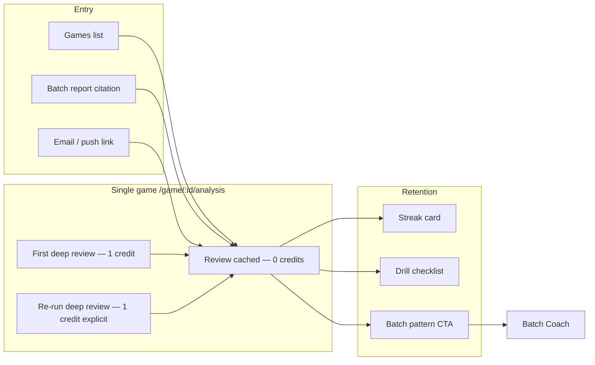
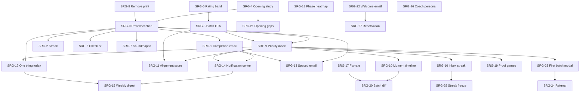

# Single-Game Retention & Batch Bridge Plan

**Status:** 🔒 Locked — scope frozen; track progress via checkboxes only. Change scope via explicit doc revision (date + rationale).  
**Created:** 2026-06-08  
**Owner:** Product / Engineering  
**Goal:** Make single-game analysis a **free-to-revisit, credit-worthy-first-run** drill-down that pulls users into batch coach, improves retention, and beats Chess.com/Lichess on **coaching proof** — not engine breadth.

**Related:** [SINGLE_GAME_ANALYSIS_IMPLEMENTATION_PLAN.md](./SINGLE_GAME_ANALYSIS_IMPLEMENTATION_PLAN.md), [BATCH_REPORT_UX_PLAN.md](./BATCH_REPORT_UX_PLAN.md), [DIFFERENTIATION_MATRIX.md](./DIFFERENTIATION_MATRIX.md), [PRODUCT_CONTRACT.md](./PRODUCT_CONTRACT.md)

---

## 0. Scope lock

### In scope (this plan)

| ID | Feature |
|----|---------|
| **SRG-0** | Review cached report without spending credits |
| **SRG-1** | Completion email/push with headline + worst-moment deep link |
| **SRG-2** | “You vs engine” blunder-free streak |
| **SRG-3** | Batch pattern CTA on single-game report |
| **SRG-4** | Opening-specific study link (ECO + your mistakes in that opening) |
| **SRG-5** | Rating-band comparison copy (“Players at ~1200 miss this…”) |
| **SRG-6** | 5-minute drill checklist (checkboxes, `localStorage`) |
| **SRG-7** | Move navigation sound/haptic (classification-aware) |
| **SRG-8** | Remove print/PDF from single-game (and align batch print policy separately) |
| **SRG-9** | Priority inbox — batch priorities queue; single-game marks “reviewed” |
| **SRG-10** | “Moment in N batches” timeline across batch runs |
| **SRG-11** | Coach alignment score — batch claim vs single-game confirmation |
| **SRG-12** | Dashboard “one thing today” — worst moment from latest batch or single game |
| **SRG-13** | Spaced-repetition reminder email (7-day, anti-spam hardened) |
| **SRG-14** | In-app notification center (bell — inbox + completions) |
| **SRG-15** | Weekly coach digest email (max 1/week, anti-spam) |
| **SRG-16** | Priority inbox streak (“5 days clearing coach items”) |
| **SRG-17** | Fix-rate score (“You fixed 2/3 patterns from last batch”) |
| **SRG-18** | Win/loss × phase heatmap + example games |
| **SRG-19** | Auto-pick 3 proof games — seed inbox after batch |
| **SRG-20** | Batch A vs B moment diff (swing trend) |
| **SRG-21** | Opening repertoire gap → your lost games |
| **SRG-22** | Welcome + email-confirmation onboarding mail |
| **SRG-23** | Post-first-batch celebration modal |
| **SRG-24** | Referral credits |
| **SRG-25** | Inbox streak freeze (1× per calendar month) |
| **SRG-26** | Coach persona tone (direct vs encouraging) |
| **SRG-27** | Inactive 30-day reactivation email (strict opt-in) |

### Deferred — product decision pending (not locked)

See **§9** for plain-language explainers. Promote to SRG-28+ only after explicit approval.

| ID | Idea |
|----|------|
| **DX-01** | PWA “Add to Home Screen” install prompt |
| **DX-02** | Moment share as social OG preview image |
| **DX-03** | Training plan `.ics` calendar export |

### Out of scope (explicit)

- Print/PDF export for single-game reports  
- New OpenAI calls per game (batch invariant: one OpenAI call per **batch** only; single-game coach stays one call per **first** depth-20 run)  
- Opening DB parity with Lichess/Chess.com  
- Social feed / leaderboards  
- Push infrastructure beyond email + optional Web Push (Phase 2)  
- **Marketing drip campaigns** (5-day nurture sequences, promotional blasts) — separate opt-in only  
- **Multi-email days** — see §3 global email budget; never stack completion + digest + spaced on same day

### Global email budget (all SRG mail)

| Type | Cap | Default |
|------|-----|---------|
| Confirmation (SRG-22) | 1 per signup | Always (transactional) |
| Welcome (SRG-22) | 1 after verify | Always (transactional) |
| Analysis complete — single/batch (SRG-1 + batch existing) | 1 per job | User preference on |
| Weekly digest (SRG-15) | 1 per 7 days | Opt-in off |
| Spaced moment (SRG-13) | 1 per 7 days | Opt-in off; **mutually exclusive** with digest in same week |
| Reactivation (SRG-27) | 1 per 30 days | Opt-in off; only if no login + no batch in 30d |

**Rule:** Per user, max **2 coaching emails in any 7-day window** (excluding confirmation/welcome/reactivation). Implementation: shared `EmailSendLog` checked by all senders.

---

## 1. Problem statement

Today users experience:

1. **Re-opening a analyzed game feels like a new paid run** — `SingleGameAnalysis.js` mounts → `startAnalysis()` unless `localStorage` says complete; Games list still POSTs `/analyze/` for “view report.”
2. **Backend already caches** complete analysis (`GameAnalyzer` returns existing when `status == complete` and not `force_reanalyze`), but UX does not distinguish **Review** vs **Re-run (1 credit)**.
3. **Retention hooks are thin** — email exists (`single_game_notifications.py`) but lacks headline + moment link; no streak, no batch proof, no checklist.
4. **Print adds clutter** — product direction is to remove print, not invest in PDF.

---

## 2. North-star UX

**Mental model for users:**  
*“I paid once for depth-20. I can come back anytime. I only pay again if I want a fresh engine pass.”*

---

## 3. Work packages (implementation order)

### P0 — Trust & revisit (ship first)

#### SRG-0: Review cached report (0 credits)

**Why:** Core user request; unlocks all retention features (users must revisit without fear of charges).

| Layer | Work |
|-------|------|
| **API contract** | `GET /api/v1/games/{id}/analysis/` remains the read path. Document: never charges credits. `POST .../analyze/` only when user explicitly starts or re-runs. |
| **Backend** | Ensure `analyze` with `force_reanalyze=false` on complete analysis returns immediately with `cached: true` in task payload (observability). No credit deduction on cache hit (verify `charge_single_game_credit` path). |
| **Frontend — route** | Support `?mode=review` (default when game `analysis_status` is `analyzed`/`completed`). `mode=run` only from explicit “Analyze” / first-time. |
| **Frontend — mount** | `SingleGameAnalysis` init order: (1) `fetchGameAnalysis`, (2) if `hasRenderableAnalysisData` → render report, **skip** `startAnalysis`, (3) else if never analyzed → confirm → `startAnalysis`, (4) `forceReanalyze` only from labeled button. Remove reliance on `localStorage analysis_complete_*` as primary gate (use API + game status). |
| **Games list** | Analyzed games: primary CTA **“View report”** → navigate only (no POST). Secondary: **“Re-run (1 credit)”** with confirm dialog. Unanalyzed: **“Analyze (1 credit)”** with confirm. |
| **Report actions** | Rename/clarify: **“Re-run deep review (1 credit)”** stays; add subtle **“Saved report · depth 20”** banner with `completed_at` / engine version. |
| **Analytics** | `single_game_review` (cached) vs `single_game_analyze_start` vs `single_game_reanalyze`. |

**Acceptance criteria**

- [ ] Opening `/game/:id/analysis` for an already-complete game shows report in &lt;2s with **no** progress bar and **no** credit confirm.
- [ ] Games row “View report” never calls `POST /analyze/`.
- [ ] Re-run still costs 1 credit and shows confirm.
- [ ] Tests: `SingleGameAnalysis.test.js` — cached fetch path; `Games.test.js` — view vs analyze CTAs.

**Primary files:** `SingleGameAnalysis.js`, `Games.js`, `gameAnalysisService.js`, `game_views.py`, `game_analyzer.py`, `single_game_credits.py`

---

#### SRG-8: Remove print from single-game

| Work | Detail |
|------|--------|
| Remove | `handlePrint`, “Print summary” button, `single_game_print` analytics event |
| Remove / trim | `singleGamePrint.css` print-specific rules if unused |
| Keep | Copy link, Share moment |
| Batch | Note in BATCH_REPORT_UX_PLAN — print removal is separate decision |

**Acceptance criteria**

- [ ] No print button on single-game report.
- [ ] No `window.print()` from single-game components.

**Primary files:** `SingleGameReportActions.js`, `singleGamePrint.css`, `SingleGameReport.js`

---

### P1 — Retention notifications

#### SRG-1: Email/push on completion with headline + worst moment

**Baseline:** `send_single_game_complete_email` exists; template `email/single_game_complete.html`.

| Work | Detail |
|------|--------|
| **Email subject** | Dynamic: `"{headline}"` from `coaching.headline` or fallback `Move {n} swung your game` |
| **Email body** | Takeaway (1 line), accuracy, opponent, opening, **CTA** → `{frontend}/game/{id}/analysis?move={n}&mode=review` |
| **Worst moment** | Use `critical_moments[0]` — played vs best, swing, optional board thumbnail later |
| **Preferences** | Respect `user_wants_analysis_completion_email` (existing) |
| **Push (phase 1b)** | Optional Web Push subscription table + service worker; same payload as email. Defer if email-only ships first. |
| **Trigger** | On `analyze_game_task` SUCCESS after **new** completion (not cache hit return) |

**Acceptance criteria**

- [ ] User with email enabled receives mail within 5 min of completion.
- [ ] Link opens report at worst moment ply (existing `?move=` support).
- [ ] No email on cache-hit “instant complete.”
- [ ] Test: `test_single_game_notifications.py` asserts headline + moment URL in rendered HTML.

**Primary files:** `single_game_notifications.py`, `tasks.py`, `templates/email/single_game_complete.html`, `SingleGameHero` fields (`headline`)

---

### P2 — Engagement & batch bridge

#### SRG-2: “You vs engine” streak

**Definition:** Consecutive **analyzed games** (user’s moves only) with no **blunder or missed_win** ≥ 1.0 pawn swing (align with `resolveMoveClassification` / `eval_change`).

| Work | Detail |
|------|--------|
| **Backend (optional)** | `Profile.single_game_streak` JSON `{count, last_game_id, updated_at}` updated on analysis complete; or compute client-side from last N analyses |
| **Frontend** | Card on report + Games header chip: “🔥 3 games without a 1+ pawn blunder” |
| **Reset** | Any qualifying blunder/missed_win in latest analyzed game |
| **Empty** | Hide card when streak &lt; 2 |

**Acceptance criteria**

- [ ] Streak increments after clean game; resets after blunder.
- [ ] Copy is plain English, not “half-moves.”

**Primary files:** `SingleGameReport.js` or `ReportInsightCards.js`, `stats_helpers.py` or `Profile` extension, migration if persisted server-side

---

#### SRG-3: Batch pattern CTA after single game

**Copy example:** *“This pattern appeared in 4 of 12 games in your March batch — see batch priorities.”*

| Work | Detail |
|------|--------|
| **Data** | When `batch_context` present: `batch_id`, `priority.title`, `pattern_count`, `batch_game_count` from `alignMomentsWithBatchContext` / batch report payload |
| **When absent** | CTA: *“Want patterns across many games? Start Batch Coach.”* (existing footer — elevate) |
| **Link** | `/batch-report/{batch_id}` or `/batch-report/{id}?priority={n}` |
| **Analytics** | `single_game_batch_cta_click` |

**Acceptance criteria**

- [ ] From batch deep-link, CTA shows real counts when batch report has pattern metadata.
- [ ] Without batch, shows batch upsell (not empty).

**Primary files:** `SingleGameFooterCta.js`, `single_game_context.py`, `SingleGameReport.js`, `BatchContextBanner.js`

---

#### SRG-4: Opening-specific study link (ECO + your mistakes)

| Work | Detail |
|------|--------|
| **Inputs** | `game_context.eco`, `opening_name`, player’s bad moves in opening phase (plies ≤ opening boundary or move_number ≤ 12 heuristic) |
| **Link** | Lichess `/analysis?q={opening}` + optional `?fen=` from first opening mistake |
| **Label** | `Study {ECO} {Opening} — you had {n} inaccuracies in the opening` |
| **Fallback** | Generic opening study if ECO missing |

**Acceptance criteria**

- [ ] Drill button text mentions opening name and mistake count when data exists.

**Primary files:** `singleGameDrillLinks.js`, `SingleGameReport.js`, metrics `phases.opening`

---

#### SRG-5: Rating-band comparison

**Baseline:** `rating_band_coaching.py` has band text; no single-game surfacing.

| Work | Detail |
|------|--------|
| **Data** | User rating from profile; band table (e.g. 1000–1199, 1200–1399) with static or computed miss rates per moment **type** (tactical_oversight, opening_inaccuracy, etc.) |
| **Copy** | *“Players near 1200 miss this tactic ~40% of the time in similar positions.”* — only when batch or moment `type` maps to band stat |
| **Honesty** | Label as “ChessMate benchmark” until real aggregated data; start with conservative static table in `rating_band_coaching.py` |
| **UI** | Small callout under critical moment explanation or insight card |

**Acceptance criteria**

- [ ] No fabricated precision — show band range, not false exactitude.
- [ ] Hidden when rating unknown.

**Primary files:** `rating_band_coaching.py`, `CriticalMomentsSection.js`, `ReportInsightCards.js`

---

#### SRG-6: 5-minute drill checklist

| Work | Detail |
|------|--------|
| **Items** | Generated from `coaching.do_today` + worst moment replay + optional Lichess link (3–4 checkboxes max) |
| **Storage** | `localStorage` key `sg_drill_{gameId}_{completedAt}` — no server write |
| **UI** | Collapsible card; progress “2/4 done”; persists until user clears or new re-run |
| **Analytics** | `single_game_drill_complete` when all checked |

**Acceptance criteria**

- [ ] Checkboxes persist across refresh.
- [ ] New re-run resets checklist.

**Primary files:** new `DrillChecklistSection.js`, `SingleGameReport.js`

---

#### SRG-7: Move navigation sound/haptic

| Work | Detail |
|------|--------|
| **Sounds** | Short subtle ticks; distinct tone for blunder/mistake vs best/brilliant vs neutral (Web Audio API, mute toggle) |
| **Haptic** | `navigator.vibrate(10)` on mobile for blunder/missed_win only |
| **A11y** | Respect `prefers-reduced-motion`; default muted until user opts in (localStorage `sg_sound_enabled`) |
| **Scope** | Position review ←/→ and move list selection |

**Acceptance criteria**

- [ ] Mute toggle in position review.
- [ ] No sound when reduced-motion preferred.

**Primary files:** `SingleGameBoardPanel.js`, new `moveFeedbackAudio.js`

---

### P3 — Batch ↔ single loop (coach workflow)

#### SRG-9: Priority inbox (batch sets priorities; single-game marks reviewed)

**Why:** Batch report ends with Top 3 priorities — users forget them. Inbox turns priorities into **actionable queue items** with proof links.

| Work | Detail |
|------|--------|
| **Data model** | `Profile.priority_inbox` JSON or table `PriorityInboxItem`: `{batch_id, priority_index, title, drill, linked_game_id?, linked_move?, status: pending|reviewed, reviewed_at, source_batch_completed_at}` |
| **Seed** | On batch `completed` / `partial` with coaching: upsert up to 3 items from `top_3_priorities`; dedupe by `(user_id, batch_id, priority_index)` |
| **Dashboard** | “Coach inbox” card: N pending; each row → batch report or `/game/{id}/analysis?move=&batch=&priority=` |
| **Single-game** | When opened with `?batch=&priority=`: show banner “Priority 2 of 3 from your batch”; on scroll to moment or 30s dwell → **Mark reviewed** (explicit button + auto optional) |
| **Progress** | Batch report shows “2/3 priorities reviewed” with links back to inbox |
| **Analytics** | `priority_inbox_reviewed`, `priority_inbox_open` |

**Acceptance criteria**

- [ ] New batch creates inbox items; old batch items archived (not deleted) for timeline (SRG-10).
- [ ] Reviewing linked single-game moment marks item reviewed without extra credit.
- [ ] Inbox empty state points to “Start Batch Coach.”

**Primary files:** new `priority_inbox.py` service, `Dashboard.js`, `BatchContextBanner.js`, `SingleGameReport.js`, batch completion task in `tasks.py`

**Depends on:** SRG-0 (free revisit), SRG-3 (batch deep links)

---

#### SRG-10: “Moment in N batches” timeline

**Why:** Shows **progress over time** — ChessMate’s moat vs one-off analysis tools.

| Work | Detail |
|------|--------|
| **Matching** | Normalize moment signature: `{pattern_or_type, phase, opening_eco?}` from batch `phase_motifs` / `recurring_weaknesses` + single-game `critical_moments` |
| **Storage** | Append-only `MomentTimelineEvent`: `{user_id, signature, batch_id?, game_id?, move_number, eval_swing, occurred_at}` |
| **UI** | On single-game report + batch moment cards: “This pattern appeared in **3 batches** (Jan, Mar, Jun)” sparkline or compact list |
| **Trend** | Optional copy: “Avg swing down 0.4 pawns since first batch” when ≥2 events |
| **Privacy** | User-only; no public leaderboard |

**Acceptance criteria**

- [ ] Same tactical theme in two batches increments count.
- [ ] Timeline hidden when only one event.

**Primary files:** `pattern_analyzer.py` (reuse motifs), new `moment_timeline.py`, `CriticalMomentsSection.js`, `BatchReport` moment blocks

**Depends on:** SRG-9 (batch linkage), at least 2 batch reports per user for value

---

#### SRG-11: Coach alignment score

**Copy example:** *“Batch said middlegame — this game confirms 3/4 critical moments.”*

| Work | Detail |
|------|--------|
| **Inputs** | `batch_context.priority.phase` or weakest phase from batch; single-game `phases` accuracy + `critical_moments` phases |
| **Score** | `alignment = confirmed_moments / relevant_moments` where “relevant” = moments in batch’s weakest phase (or priority phase) |
| **UI** | Badge on single-game when `batch_id` present: green ≥75%, amber 50–74%, neutral &lt;50% with coach copy |
| **Mismatch** | “Batch flagged opening; this game’s swing was endgame — still worth review.” (honest, not punitive) |

**Acceptance criteria**

- [ ] Score only shown when opened from batch or `batch_context` exists.
- [ ] Tooltip explains numerator/denominator in plain language.

**Primary files:** `single_game_context.py`, `SingleGameReport.js` or `BatchContextBanner.js`

**Depends on:** SRG-3, SRG-9

---

#### SRG-12: Dashboard “one thing today”

**Why:** One clear action beats a wall of stats — drives daily return without email.

| Work | Detail |
|------|--------|
| **Selection algorithm** | Priority order: (1) oldest **pending** inbox item (SRG-9), (2) worst moment from latest **batch** if no inbox, (3) worst moment from latest **single-game** analysis, (4) fallback: “Import 5 games for Batch Coach” |
| **UI** | Hero card on Dashboard: headline, opponent/opening, “5 min drill”, CTA link |
| **Dismiss** | Snooze 24h (`localStorage` or server `snoozed_until`) — not permanent delete |
| **Analytics** | `one_thing_today_click`, `one_thing_today_snooze` |

**Acceptance criteria**

- [ ] Card updates when user completes inbox item or new batch finishes.
- [ ] Never blank for users with ≥1 analyzed game or batch.

**Primary files:** `dashboardFocus.js`, `Dashboard.js`, SRG-9 inbox API

**Depends on:** SRG-0, SRG-9 (preferred), SRG-1 data paths

---

#### SRG-13: Spaced-repetition reminder email (7-day, anti-spam)

**Why:** Resurface the **one** moment users still get wrong — without becoming spam.

**Product rule:** This is a **single optional coaching reminder**, not a drip campaign.

| Work | Detail |
|------|--------|
| **Eligibility** | User opted in (`wants_spaced_repetition_email`, default **off**); has ≥1 reviewed moment with swing ≥0.5; moment not reviewed again in 7 days |
| **Schedule** | **One** Celery beat job daily; per user max **1** spaced email per **7 rolling days** (hard cap) |
| **Idempotency** | `SpacedReminderLog(user_id, moment_key, sent_at)` — never send duplicate for same `(user, game_id, move_number)` within 30 days |
| **Queue safety** | Claim row with `SELECT FOR UPDATE` or redis lock `spaced_email:{user_id}`; skip if completion email (SRG-1) sent in last 48h |
| **Content** | Subject: “Still thinking about move {n}?”; body: one line reminder + link to `?mode=review&move=`; unsubscribe + preference link in footer |
| **Batch cap** | Global send rate limit (e.g. 500/hour) to protect domain reputation |
| **No stacking** | If user has 5 eligible moments, pick **highest swing** only — never multi-moment digest in v1 |
| **Unsubscribe** | One-click disables spaced repetition only; completion emails separate preference |

**Acceptance criteria**

- [ ] User with 3 eligible moments receives **at most 1** email in 7 days.
- [ ] Re-clicking link does not schedule another email for same moment within 30 days.
- [ ] Opt-out stops all spaced emails; completion emails unchanged.
- [ ] Tests: idempotency, 48h SRG-1 collision skip, 7-day user cap.

**Primary files:** new `spaced_repetition_email.py`, `notification_preferences.py`, Celery beat schedule, migration `SpacedReminderLog`

**Depends on:** SRG-1 (preference infra), SRG-0 (review link must be free)

**Anti-spam checklist (mandatory before ship)**

- [ ] Default opt-in **off**; explicit toggle in account settings with copy explaining frequency  
- [ ] List-Unsubscribe header + one-click  
- [ ] No email if user logged in and reviewed moment in last 72h (activity skip)  
- [ ] Monitor bounce/complaint rate; auto-pause spaced job if complaint rate &gt; 0.1%  

---

### P4 — Growth, dashboard intelligence & notification hub

#### SRG-14: In-app notification center

**Why:** Inbox items and analysis completions should not require email — reduces spam pressure and increases daily opens.

| Work | Detail |
|------|--------|
| **Model** | `UserNotification`: `{type, title, body, href, read_at, created_at, meta}` — types: `inbox_item`, `single_complete`, `batch_complete`, `fix_rate`, `weekly_digest_summary` |
| **API** | `GET/PATCH /api/v1/notifications/` — list unread, mark read, mark all read |
| **UI** | Bell in nav with badge count; dropdown list; “View all” → dashboard notifications panel |
| **Seeding** | Create notification when SRG-9 inbox item added, SRG-1/batch complete, SRG-17 fix-rate ready |
| **Realtime** | Poll on dashboard focus or 60s interval (WebSocket deferred) |

**Acceptance criteria**

- [ ] Unread count matches pending inbox + unread completions since last visit.
- [ ] Clicking notification deep-links to correct report/moment (`?mode=review`).
- [ ] No duplicate notifications for same `(type, entity_id)` within 24h.

**Primary files:** new `notifications` app or `core/notifications.py`, `Navbar`/`Layout`, `Dashboard.js`

**Depends on:** SRG-9, SRG-1; complements SRG-12

---

#### SRG-15: Weekly coach digest (max 1/week)

**Why:** Safer retention email than per-moment spaced mail — one curated summary.

| Work | Detail |
|------|--------|
| **Schedule** | Single beat job (e.g. Tuesday 10:00 user TZ or UTC fallback); **max 1 per user per 7 days** |
| **Content** | Pending inbox count (SRG-9), one thing today link (SRG-12), streak (SRG-2/16), fix-rate teaser (SRG-17) if new batch, CTA dashboard |
| **Opt-in** | `wants_weekly_digest` default **off**; separate from spaced (SRG-13) — if both on, **digest wins**, skip spaced that week |
| **Idempotency** | `EmailSendLog(type=weekly_digest, week_key=YYYY-WW)` |
| **In-app mirror** | Same payload as SRG-14 notification — email optional if user enabled in-app only |

**Acceptance criteria**

- [ ] User never receives digest + spaced + completion on same calendar day.
- [ ] Empty state: skip send if no pending inbox, no new analysis, no streak (don’t mail “nothing to do”).

**Primary files:** `weekly_digest_email.py`, `EmailSendLog`, `notification_preferences.py`

**Depends on:** SRG-9, SRG-12, SRG-14, global email budget

---

#### SRG-16: Priority inbox streak

**Why:** Gamify clearing coach queue without email.

| Work | Detail |
|------|--------|
| **Definition** | Consecutive **calendar days** with ≥1 inbox item marked `reviewed` |
| **Storage** | `Profile.inbox_streak` JSON `{count, last_reviewed_date}` |
| **UI** | Chip on dashboard + inbox: “🔥 5-day coach streak”; breaks on missed day (no freeze in v1) |
| **Milestone** | Copy at 3 / 5 / 7 days — no extra emails |

**Acceptance criteria**

- [ ] Streak increments once per day max when user reviews any inbox item.
- [ ] Shown only when streak ≥ 2.

**Primary files:** SRG-9 service, `Dashboard.js`, `ReportInsightCards.js`

**Depends on:** SRG-9

---

#### SRG-17: Fix-rate score

**Copy:** *“You fixed 2/3 patterns from your January batch.”*

| Work | Detail |
|------|--------|
| **Matching** | Compare previous batch `top_3_priorities` / `recurring_weaknesses` signatures to new batch motifs + phase accuracy deltas |
| **Score** | `fixed = patterns absent or swing improved`; display on new batch report hero + dashboard + SRG-14 notification |
| **Single-game tie-in** | List proof games where pattern **did not** recur (wins) vs still present (needs work) |

**Acceptance criteria**

- [ ] Only shown when user has ≥2 batches.
- [ ] Tooltip explains what “fixed” means (honest heuristic).

**Primary files:** `batch_metrics.py`, `BatchReportHeader.js`, `dashboardFocus.js`

**Depends on:** SRG-10 signatures, SRG-9

---

#### SRG-18: Win/loss × phase heatmap

**Copy:** *“You lose winning middlegames”* with links to example games.

| Work | Detail |
|------|--------|
| **Data** | Per batch/single: phase accuracy + result (W/L/D) from `game_context`; aggregate 2×3 grid (result × phase) |
| **UI** | Dashboard card heatmap (green/red intensity); click cell → filtered games list or worst single-game moment |
| **Threshold** | Only highlight cells with ≥3 games and accuracy &lt; 55% or eval swing pattern |

**Acceptance criteria**

- [ ] Each highlighted cell links to ≥1 single-game report (SRG-0 review).
- [ ] Hidden when &lt; 5 analyzed games total.

**Primary files:** `dashboardFocus.js`, new `PhaseResultHeatmap.js`, batch per-game results

**Depends on:** SRG-0, batch `per_game_results`

---

#### SRG-19: Auto-pick 3 proof games (seed inbox)

**Why:** After batch, user shouldn’t guess which games prove priorities.

| Work | Detail |
|------|--------|
| **Algorithm** | For each top priority/motif: pick game with highest swing in matching phase from `per_game_results` + `critical_moments` |
| **Output** | Attach `linked_game_id` + `move` to SRG-9 inbox items (3 priorities → up to 3 games, dedupe) |
| **UI** | Inbox copy: “Worst Sicilian example: vs Opponent, move 12” |

**Acceptance criteria**

- [ ] 100% of new batches with coaching produce ≥1 linked proof game when moments exist.
- [ ] Links open free review (SRG-0).

**Primary files:** `priority_inbox.py`, `single_game_context.py`, batch chord callback

**Depends on:** SRG-9, batch complete pipeline

---

#### SRG-20: Batch A vs B moment diff

| Work | Detail |
|------|--------|
| **UI** | On batch report (when previous batch exists): “Compared to last batch” section — pattern name, swing then vs now, sparkline from SRG-10 timeline |
| **Metrics** | Count patterns **resolved**, **unchanged**, **new** |
| **Single-game** | Each diff row links to proof game from either batch |

**Acceptance criteria**

- [ ] Section hidden on first batch.
- [ ] At least top 3 recurring patterns compared.

**Primary files:** `BatchReportSections.js`, SRG-10 timeline service, `batch_context` compare API

**Depends on:** SRG-10, SRG-17

---

#### SRG-21: Opening repertoire gap → your lost games

| Work | Detail |
|------|--------|
| **Data** | Batch `repertoire_gaps` / opening matchups + user losses in those ECO lines from `per_game_results` |
| **UI** | Opening section: gap card → “You lost 3 games in this line” → list with links to single-game review |
| **Drill** | SRG-4 study link + specific loss game FEN |

**Acceptance criteria**

- [ ] Each gap with losses shows ≥1 game link.
- [ ] Works without full opening DB (uses batch + game metadata only).

**Primary files:** `openingInsights.js`, batch openings section, `singleGameDrillLinks.js`

**Depends on:** SRG-4, SRG-0

---

#### SRG-22: Welcome + email-confirmation onboarding

**Baseline:** In-app `WelcomeGuide.js` exists; email path may be incomplete.

**Market standard (2025 SaaS / chess tools)**

| Email | When | Required? | Content |
|-------|------|-------------|---------|
| **Confirmation** | Signup, before full access | **Yes** (transactional) | Verify link only; no marketing |
| **Welcome** | **After** email verified | Recommended (1 only) | 3 steps, 1 CTA, credits mention |
| **Drip nurture** | Days 1–7 | Optional | **Out of scope** — separate marketing opt-in |

**ChessMate welcome content (one email)**

1. Connect Chess.com or Lichess  
2. Import games (mention signup bonus credits from `SIGNUP_BONUS_CREDITS`)  
3. Run **Batch Coach** (5+ games) — single-game depth-20 is optional drill-down  

**Do not:** Send welcome before verify; duplicate welcome on every login; send if user already dismissed `WelcomeGuide` and completed import (skip or send shorter “ready for batch” variant).

| Work | Detail |
|------|--------|
| **Confirmation** | Ensure Django/allauth (or current auth) sends verify email; branded template |
| **Welcome** | Signal on `email_confirmed` → queue welcome once (`WelcomeEmailLog`) |
| **Sync** | Welcome CTA = same as `WelcomeGuide` first step (connect account) |
| **Preference** | Cannot unsubscribe confirmation; welcome is transactional one-time |

**Acceptance criteria**

- [ ] Exactly 1 welcome email per user lifetime.
- [ ] Confirmation resend rate-limited (existing auth limits).
- [ ] Tests: no welcome without verify; no duplicate welcome.

**Primary files:** auth signals, `templates/email/welcome.html`, `WelcomeGuide.js` copy alignment

**Depends on:** None (P4 onboarding — can ship early)

---

### P5 — Activation, growth & polish

#### SRG-23: Post-first-batch celebration modal

**Why:** First batch complete is the **aha moment** — celebrate it and route to inbox + proof games.

| Work | Detail |
|------|--------|
| **Trigger** | User’s first ever batch `completed` or `partial` with coaching + ≥5 games analyzed |
| **UI** | Modal: headline from batch executive summary, fix-rate N/A on first, CTA “Review your #1 priority” → SRG-9 inbox / proof game |
| **Persistence** | `Profile.first_batch_celebrated_at` — show once only |
| **Also** | SRG-14 notification + optional confetti (respect `prefers-reduced-motion`) |

**Acceptance criteria**

- [ ] Modal never shows on second batch.
- [ ] Dismissible; does not block report view.

**Primary files:** `BatchAnalysisResults.js` or post-report redirect, `Dashboard.js`, SRG-14

**Depends on:** SRG-9, SRG-19 (ideal), batch complete flow

---

#### SRG-24: Referral credits

**Copy:** *“Invite a friend — you both get 1 credit when they run their first batch.”*

| Work | Detail |
|------|--------|
| **Mechanic** | Unique referral code/link per user; credit grant on referee **first batch complete** (not signup — reduces fraud) |
| **Rewards** | Configurable: e.g. 1 credit each, cap 10 referrals/month per referrer |
| **Anti-abuse** | Same IP/device fingerprint soft block; no self-referral; email domain heuristics optional |
| **UI** | Credits page + post-first-batch modal secondary CTA |
| **Analytics** | `referral_link_copy`, `referral_batch_completed` |

**Acceptance criteria**

- [ ] Credits apply only after referee’s first successful batch.
- [ ] Referrer cannot earn &gt; monthly cap.

**Primary files:** `credit_fulfillment.py` pattern, new `referral.py`, `Credits.js`, migration `ReferralRedemption`

**Depends on:** SRG-23 (natural surfacing); batch pipeline

---

#### SRG-25: Inbox streak freeze (1× per month)

**Why:** SRG-16 streak breaks on one busy day — freeze reduces guilt churn.

| Work | Detail |
|------|--------|
| **Rule** | User can **freeze** inbox streak once per calendar month — next missed day does not reset |
| **UI** | Dashboard streak chip → “Use freeze (1 left this month)” when streak ≥3 and user missed yesterday |
| **Storage** | `Profile.inbox_streak_freeze_used_at` (month key) |

**Acceptance criteria**

- [ ] Second freeze in same month blocked with clear copy.
- [ ] Freeze does not increment streak — only preserves count.

**Primary files:** SRG-16 streak service, `Dashboard.js`

**Depends on:** SRG-16

---

#### SRG-26: Coach persona tone (direct vs encouraging)

**Why:** Same Stockfish facts; users differ on how they want coaching **phrased**.

| Work | Detail |
|------|--------|
| **Options** | `direct` (blunt, short) vs `encouraging` (supportive, same facts) — settings toggle |
| **Scope** | Prompt modifier on **existing** single-game coach call + batch coaching call — **no extra OpenAI calls** |
| **Invariant** | Facts/moves/metrics unchanged; tone only |
| **Default** | `encouraging` |

**Acceptance criteria**

- [ ] Toggle in account settings; applies to **next** analysis/batch only.
- [ ] Schema fields unchanged (batch invariant).

**Primary files:** `single_game_coach_generator.py`, `coaching_generator.py`, `Profile.coach_persona`, settings UI

**Depends on:** SRG-1 coaching copy paths

---

#### SRG-27: Inactive 30-day reactivation email

**Why:** Win back users who imported but disappeared — without becoming spam.

| Work | Detail |
|------|--------|
| **Eligibility** | Opt-in `wants_reactivation_email` default **off**; no login 30d; no batch started 30d; has connected account or imported games |
| **Cap** | **1 email per 30 rolling days**; `EmailSendLog(type=reactivation)` |
| **Content** | One CTA: “Your games are waiting — run Batch Coach” (not multiple links) |
| **Skip if** | User received SRG-15 digest or SRG-13 spaced in last 7d |
| **Unsubscribe** | Separate preference; counts toward global budget |

**Acceptance criteria**

- [ ] User active in last 29 days receives zero reactivation mail.
- [ ] Opt-out immediate; no follow-up sequence.

**Primary files:** `reactivation_email.py`, `EmailSendLog`, `notification_preferences.py`

**Depends on:** SRG-22 preference patterns, global email budget

---

## 4. Dependency graph

**Recommended sprint order**

| Phase | Packages |
|-------|----------|
| **P0 Trust** | SRG-0 → SRG-8 |
| **P1 Notify** | SRG-1 → SRG-6 → **SRG-22** (welcome can parallel P1) |
| **P2 Engage** | SRG-3 → SRG-4 → SRG-2 → SRG-5 → SRG-7 |
| **P3 Loop** | SRG-9 → SRG-19 → SRG-11 → SRG-12 → SRG-16 → SRG-10 → SRG-17 → SRG-20 |
| **P4 Hub** | SRG-14 → SRG-18 → SRG-21 → SRG-15 → SRG-13 |
| **P5 Growth** | SRG-23 → SRG-24 → SRG-25 → SRG-26 → SRG-27 |

**Email ship order:** SRG-22 → SRG-1 → SRG-15 → SRG-13 → SRG-27 (each gated on `EmailSendLog` + preferences). Prefer **digest OR spaced**, not both, until metrics prove otherwise.

---

## 5. Metrics (success)

| Metric | Target (90 days post-ship) |
|--------|----------------------------|
| Cached review sessions / new analyze starts | &gt; 3:1 |
| Email CTA click-through | &gt; 15% |
| Single-game → batch report navigation | &gt; 20% of batch-linked single sessions |
| Drill checklist completion | &gt; 30% of reports with checklist |
| Re-run rate | &lt; 10% of review sessions (proves cache path works) |
| Credit support tickets (“charged twice”) | → 0 |
| Priority inbox items marked reviewed within 14 days | &gt; 40% |
| Spaced email unsubscribe rate | &lt; 2% per send |
| Spaced email complaint rate | &lt; 0.1% (auto-pause threshold) |
| Weekly digest open rate | &gt; 25% |
| Notification center click-through | &gt; 30% of bell opens |
| Fix-rate shown on 2nd+ batch | &gt; 80% of eligible users |
| Welcome email → connect account within 7 days | &gt; 35% |
| First-batch modal → inbox or proof game click | &gt; 50% |
| Referral → referee first batch within 14 days | &gt; 10% of shared links |
| Reactivation unsubscribe rate | &lt; 3% |

---

## 6. How single-game fits the ChessMate big picture

### Roles in the product

| Layer | Batch Coach | Single-game depth-20 |
|-------|-------------|----------------------|
| **Question answered** | “What are my patterns across 5–30 games?” | “Show me **this** game, **this** move, why it hurt.” |
| **Engine** | Stockfish depth-14, per-game in chord | Stockfish depth-20, one game |
| **AI** | One OpenAI call → priorities, plan, motifs | One OpenAI call → headline, moment explanations |
| **Price** | Batch credits | 1 credit first run; **free revisit** (after SRG-0) |
| **Retention** | Email on batch complete; compare batches | Email on game complete; streak; checklist |

### The flywheel

1. **Import games** → user has library but no story.  
2. **Batch Coach** → “Your #1 issue: opening inaccuracies in the Sicilian” (pattern, counts, plan).  
3. **Single-game from batch** → jump to `game 162, move 10` with board, live eval, coaching line — **proof** the batch claim is real.  
4. **Priority inbox (SRG-9)** → “Review priority 1” deep-links to proof game.  
5. **Drill checklist + Lichess link** → user does something today.  
6. **Dashboard one thing (SRG-12)** → daily return without opening email.  
7. **Streak + completion email** → user returns for next game without paying again.  
8. **Moment timeline (SRG-10)** → “same pattern in 3 batches” proves improvement arc.  
9. **Spaced reminder (SRG-13)** → one gentle nudge at day 7 if still opted in.  
10. **Next batch** → fix-rate (SRG-17) + batch diff (SRG-20) + proof games (SRG-19); loop restarts.  
11. **Notification center (SRG-14)** → completions and inbox without inboxing email.  
12. **Weekly digest (SRG-15)** → optional Tuesday summary for opted-in users.

### Differentiation vs Chess.com / Lichess

| They win | ChessMate wins |
|----------|----------------|
| Live play, puzzles, unlimited free analysis | **Cross-game diagnosis** + **action plan** |
| Single-game depth, opening explorer | **Batch priority → single-game proof loop** |
| Generic “accuracy %” | **Named moments**, batch pattern counts, rating-band context, coach headline |

### Additional ideas (backlog — not in scope lock)

| Idea | Why it matters |
|------|----------------|
| **Human coach / parent view** | Share read-only batch + moment links (extend existing moment share) |
| **PGN paste single game** | Onboarding before user has 5 games for batch |
| **Import → batch waiver messaging** | Align copy: batch runs Stockfish on import; single-game is optional depth-20 |
| **“Before you play” micro-drill** | Browser notification: one FEN from inbox before next rated game |
| **Discord/community link in welcome** | Community retention (careful: one link, not spam) |

---

## 7. Progress tracker

| ID | Status | Notes |
|----|--------|-------|
| SRG-0 | ⬜ Not started | |
| SRG-1 | ⬜ Not started | Email partial exists |
| SRG-2 | ⬜ Not started | |
| SRG-3 | ⬜ Not started | Footer CTA exists; needs counts |
| SRG-4 | ⬜ Not started | Drill link partial |
| SRG-5 | ⬜ Not started | |
| SRG-6 | ⬜ Not started | |
| SRG-7 | ⬜ Not started | |
| SRG-8 | ⬜ Not started | |
| SRG-9 | ⬜ Not started | Priority inbox |
| SRG-10 | ⬜ Not started | Moment timeline |
| SRG-11 | ⬜ Not started | Alignment score |
| SRG-12 | ⬜ Not started | Dashboard one thing |
| SRG-13 | ⬜ Not started | Spaced email — ship after digest |
| SRG-14 | ⬜ Not started | Notification center |
| SRG-15 | ⬜ Not started | Weekly digest |
| SRG-16 | ⬜ Not started | Inbox streak |
| SRG-17 | ⬜ Not started | Fix-rate score |
| SRG-18 | ⬜ Not started | Phase heatmap |
| SRG-19 | ⬜ Not started | Auto proof games |
| SRG-20 | ⬜ Not started | Batch A vs B diff |
| SRG-21 | ⬜ Not started | Opening gaps → games |
| SRG-22 | ⬜ Not started | Welcome + confirm email |
| SRG-23 | ⬜ Not started | First-batch celebration |
| SRG-24 | ⬜ Not started | Referral credits |
| SRG-25 | ⬜ Not started | Streak freeze |
| SRG-26 | ⬜ Not started | Coach persona |
| SRG-27 | ⬜ Not started | 30d reactivation |

**Changelog**

| Date | Change |
|------|--------|
| 2026-06-08 | Plan locked — initial scope from product review |
| 2026-06-08 | Scope revision — added SRG-9…SRG-13 (priority inbox, timeline, alignment, one thing today, spaced email w/ anti-spam) |
| 2026-06-08 | Scope revision — added SRG-14…SRG-22 (notification hub, digest, streaks, fix-rate, heatmap, proof games, batch diff, opening gaps, welcome mail); global email budget |
| 2026-06-08 | Scope revision — added SRG-23…SRG-27 (celebration, referral, streak freeze, persona, reactivation); DX-01…03 deferred pending decision |

---

## 8. Revision policy

To change this plan: edit this file, bump **Changelog**, and announce in PR description. Do not add features via drive-by PRs without updating §0 scope lock.

---

## 9. Deferred ideas — explainers (your decision)

These are **not built** until you promote them to SRG-28+. Below is what each means in plain language and a recommendation.

### DX-01: PWA “Add to Home Screen” install prompt

**What it is:** A Progressive Web App (PWA) lets ChessMate behave more like a phone app when opened from the home screen — full-screen, icon on the home screen, faster return visits. The **install prompt** is the browser banner: *“Add ChessMate to your home screen.”*

**What it is not:** Not an App Store app; not a separate codebase. It’s a manifest + service worker on your existing React site.

| Pros | Cons |
|------|------|
| Mobile users come back with one tap | iOS Safari support is weaker than Android Chrome |
| Feels more “real” than a bookmark | Maintenance (cache, updates) if you go full offline |
| Good after first batch (“keep your coach handy”) | Small % of users actually install |

**Recommendation:** **Defer until after SRG-0 + mobile traffic &gt; 20%.** Until then, mobile browser + email/notifications (SRG-14) is enough. If you ship it later, show prompt **once** after first batch (SRG-23), not on landing.

---

### DX-02: Moment share as social OG preview image

**What it is:** When someone pastes your share link in Discord/Twitter/iMessage, the preview card shows a **generated image** — mini board, “Move 10 · −8.4 swing”, ChessMate branding — instead of a generic link.

**How it works:** Server renders PNG (or SVG→PNG) per moment; `og:image` meta on `/share/game-moment/:token`.

| Pros | Cons |
|------|------|
| Viral look; credible in chess Discord | Backend image generation + hosting |
| Marketing without ads | Privacy: shared moments are already public tokens — still need sanitization |
| Complements existing “Share moment” | Low priority until share volume proves demand |

**Recommendation:** **Nice polish after moment share is used.** Cheaper interim: improve **text** preview (title + description) without dynamic image. Promote to SRG-28 if referral (SRG-24) or share analytics show traction.

---

### DX-03: Training plan `.ics` calendar export

**What it is:** Download a calendar file (`.ics`) that adds batch **4-week training plan** items to Google Calendar / Outlook — e.g. “Week 2: 20 tactics on middlegame pins.”

| Pros | Cons |
|------|------|
| Serious club players love it | Small audience vs casual players |
| Reinforces batch plan | Plan text may be vague — calendar spam feels worse than email spam |
| Differentiator for “coach” positioning | Engineering edge cases (timezones, recurring events) |

**Recommendation:** **Defer.** SRG-6 checklist + SRG-12 “one thing today” cover daily habit for most users. Revisit if users ask for calendar integration or you target coaches/clubs explicitly.

---

### How to promote a deferred item

Reply with e.g. *“Lock DX-02 as SRG-28”* and we update §0 scope + changelog the same way as SRG-23…27.
