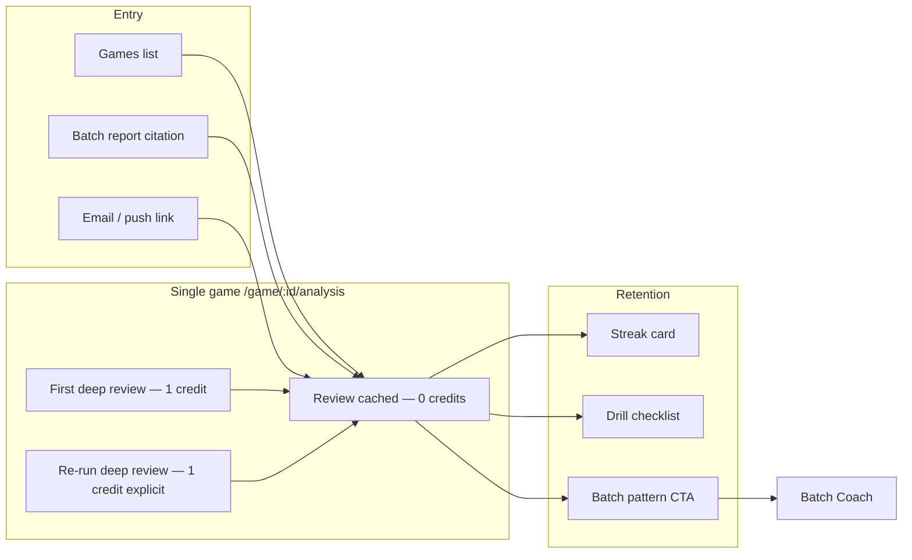
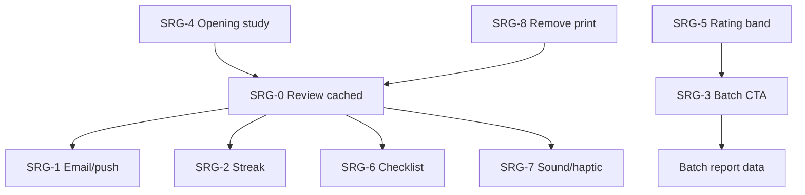

# Single-Game Retention & Batch Bridge Plan

**Status:** 🔒 Locked — scope frozen; track progress via checkboxes only. Change scope via explicit doc revision (date + rationale).  
**Created:** 2026-06-08  
**Owner:** Product / Engineering  
**Goal:** Make single-game analysis a **free-to-revisit, credit-worthy-first-run** drill-down that pulls users into batch coach, improves retention, and beats Chess.com/Lichess on **coaching proof** — not engine breadth.

**Related:** [SINGLE_GAME_ANALYSIS_IMPLEMENTATION_PLAN.md](./SINGLE_GAME_ANALYSIS_IMPLEMENTATION_PLAN.md), [BATCH_REPORT_UX_PLAN.md](./BATCH_REPORT_UX_PLAN.md), [DIFFERENTIATION_MATRIX.md](./DIFFERENTIATION_MATRIX.md), [PRODUCT_CONTRACT.md](./PRODUCT_CONTRACT.md)

---

## 0. Scope lock

### In scope (this plan)

| ID | Feature |
|----|---------|
| **SRG-0** | Review cached report without spending credits |
| **SRG-1** | Completion email/push with headline + worst-moment deep link |
| **SRG-2** | “You vs engine” blunder-free streak |
| **SRG-3** | Batch pattern CTA on single-game report |
| **SRG-4** | Opening-specific study link (ECO + your mistakes in that opening) |
| **SRG-5** | Rating-band comparison copy (“Players at ~1200 miss this…”) |
| **SRG-6** | 5-minute drill checklist (checkboxes, `localStorage`) |
| **SRG-7** | Move navigation sound/haptic (classification-aware) |
| **SRG-8** | Remove print/PDF from single-game (and align batch print policy separately) |

### Out of scope (explicit)

- Print/PDF export for single-game reports  
- New OpenAI calls per game (batch invariant: one OpenAI call per **batch** only; single-game coach stays one call per **first** depth-20 run)  
- Opening DB parity with Lichess/Chess.com  
- Social feed / leaderboards  
- Push infrastructure beyond email + optional Web Push (Phase 2)

---

## 1. Problem statement

Today users experience:

1. **Re-opening a analyzed game feels like a new paid run** — `SingleGameAnalysis.js` mounts → `startAnalysis()` unless `localStorage` says complete; Games list still POSTs `/analyze/` for “view report.”
2. **Backend already caches** complete analysis (`GameAnalyzer` returns existing when `status == complete` and not `force_reanalyze`), but UX does not distinguish **Review** vs **Re-run (1 credit)**.
3. **Retention hooks are thin** — email exists (`single_game_notifications.py`) but lacks headline + moment link; no streak, no batch proof, no checklist.
4. **Print adds clutter** — product direction is to remove print, not invest in PDF.

---

## 2. North-star UX

**Mental model for users:**  
*“I paid once for depth-20. I can come back anytime. I only pay again if I want a fresh engine pass.”*

---

## 3. Work packages (implementation order)

### P0 — Trust & revisit (ship first)

#### SRG-0: Review cached report (0 credits)

**Why:** Core user request; unlocks all retention features (users must revisit without fear of charges).

| Layer | Work |
|-------|------|
| **API contract** | `GET /api/v1/games/{id}/analysis/` remains the read path. Document: never charges credits. `POST .../analyze/` only when user explicitly starts or re-runs. |
| **Backend** | Ensure `analyze` with `force_reanalyze=false` on complete analysis returns immediately with `cached: true` in task payload (observability). No credit deduction on cache hit (verify `charge_single_game_credit` path). |
| **Frontend — route** | Support `?mode=review` (default when game `analysis_status` is `analyzed`/`completed`). `mode=run` only from explicit “Analyze” / first-time. |
| **Frontend — mount** | `SingleGameAnalysis` init order: (1) `fetchGameAnalysis`, (2) if `hasRenderableAnalysisData` → render report, **skip** `startAnalysis`, (3) else if never analyzed → confirm → `startAnalysis`, (4) `forceReanalyze` only from labeled button. Remove reliance on `localStorage analysis_complete_*` as primary gate (use API + game status). |
| **Games list** | Analyzed games: primary CTA **“View report”** → navigate only (no POST). Secondary: **“Re-run (1 credit)”** with confirm dialog. Unanalyzed: **“Analyze (1 credit)”** with confirm. |
| **Report actions** | Rename/clarify: **“Re-run deep review (1 credit)”** stays; add subtle **“Saved report · depth 20”** banner with `completed_at` / engine version. |
| **Analytics** | `single_game_review` (cached) vs `single_game_analyze_start` vs `single_game_reanalyze`. |

**Acceptance criteria**

- [ ] Opening `/game/:id/analysis` for an already-complete game shows report in &lt;2s with **no** progress bar and **no** credit confirm.
- [ ] Games row “View report” never calls `POST /analyze/`.
- [ ] Re-run still costs 1 credit and shows confirm.
- [ ] Tests: `SingleGameAnalysis.test.js` — cached fetch path; `Games.test.js` — view vs analyze CTAs.

**Primary files:** `SingleGameAnalysis.js`, `Games.js`, `gameAnalysisService.js`, `game_views.py`, `game_analyzer.py`, `single_game_credits.py`

---

#### SRG-8: Remove print from single-game

| Work | Detail |
|------|--------|
| Remove | `handlePrint`, “Print summary” button, `single_game_print` analytics event |
| Remove / trim | `singleGamePrint.css` print-specific rules if unused |
| Keep | Copy link, Share moment |
| Batch | Note in BATCH_REPORT_UX_PLAN — print removal is separate decision |

**Acceptance criteria**

- [ ] No print button on single-game report.
- [ ] No `window.print()` from single-game components.

**Primary files:** `SingleGameReportActions.js`, `singleGamePrint.css`, `SingleGameReport.js`

---

### P1 — Retention notifications

#### SRG-1: Email/push on completion with headline + worst moment

**Baseline:** `send_single_game_complete_email` exists; template `email/single_game_complete.html`.

| Work | Detail |
|------|--------|
| **Email subject** | Dynamic: `"{headline}"` from `coaching.headline` or fallback `Move {n} swung your game` |
| **Email body** | Takeaway (1 line), accuracy, opponent, opening, **CTA** → `{frontend}/game/{id}/analysis?move={n}&mode=review` |
| **Worst moment** | Use `critical_moments[0]` — played vs best, swing, optional board thumbnail later |
| **Preferences** | Respect `user_wants_analysis_completion_email` (existing) |
| **Push (phase 1b)** | Optional Web Push subscription table + service worker; same payload as email. Defer if email-only ships first. |
| **Trigger** | On `analyze_game_task` SUCCESS after **new** completion (not cache hit return) |

**Acceptance criteria**

- [ ] User with email enabled receives mail within 5 min of completion.
- [ ] Link opens report at worst moment ply (existing `?move=` support).
- [ ] No email on cache-hit “instant complete.”
- [ ] Test: `test_single_game_notifications.py` asserts headline + moment URL in rendered HTML.

**Primary files:** `single_game_notifications.py`, `tasks.py`, `templates/email/single_game_complete.html`, `SingleGameHero` fields (`headline`)

---

### P2 — Engagement & batch bridge

#### SRG-2: “You vs engine” streak

**Definition:** Consecutive **analyzed games** (user’s moves only) with no **blunder or missed_win** ≥ 1.0 pawn swing (align with `resolveMoveClassification` / `eval_change`).

| Work | Detail |
|------|--------|
| **Backend (optional)** | `Profile.single_game_streak` JSON `{count, last_game_id, updated_at}` updated on analysis complete; or compute client-side from last N analyses |
| **Frontend** | Card on report + Games header chip: “🔥 3 games without a 1+ pawn blunder” |
| **Reset** | Any qualifying blunder/missed_win in latest analyzed game |
| **Empty** | Hide card when streak &lt; 2 |

**Acceptance criteria**

- [ ] Streak increments after clean game; resets after blunder.
- [ ] Copy is plain English, not “half-moves.”

**Primary files:** `SingleGameReport.js` or `ReportInsightCards.js`, `stats_helpers.py` or `Profile` extension, migration if persisted server-side

---

#### SRG-3: Batch pattern CTA after single game

**Copy example:** *“This pattern appeared in 4 of 12 games in your March batch — see batch priorities.”*

| Work | Detail |
|------|--------|
| **Data** | When `batch_context` present: `batch_id`, `priority.title`, `pattern_count`, `batch_game_count` from `alignMomentsWithBatchContext` / batch report payload |
| **When absent** | CTA: *“Want patterns across many games? Start Batch Coach.”* (existing footer — elevate) |
| **Link** | `/batch-report/{batch_id}` or `/batch-report/{id}?priority={n}` |
| **Analytics** | `single_game_batch_cta_click` |

**Acceptance criteria**

- [ ] From batch deep-link, CTA shows real counts when batch report has pattern metadata.
- [ ] Without batch, shows batch upsell (not empty).

**Primary files:** `SingleGameFooterCta.js`, `single_game_context.py`, `SingleGameReport.js`, `BatchContextBanner.js`

---

#### SRG-4: Opening-specific study link (ECO + your mistakes)

| Work | Detail |
|------|--------|
| **Inputs** | `game_context.eco`, `opening_name`, player’s bad moves in opening phase (plies ≤ opening boundary or move_number ≤ 12 heuristic) |
| **Link** | Lichess `/analysis?q={opening}` + optional `?fen=` from first opening mistake |
| **Label** | `Study {ECO} {Opening} — you had {n} inaccuracies in the opening` |
| **Fallback** | Generic opening study if ECO missing |

**Acceptance criteria**

- [ ] Drill button text mentions opening name and mistake count when data exists.

**Primary files:** `singleGameDrillLinks.js`, `SingleGameReport.js`, metrics `phases.opening`

---

#### SRG-5: Rating-band comparison

**Baseline:** `rating_band_coaching.py` has band text; no single-game surfacing.

| Work | Detail |
|------|--------|
| **Data** | User rating from profile; band table (e.g. 1000–1199, 1200–1399) with static or computed miss rates per moment **type** (tactical_oversight, opening_inaccuracy, etc.) |
| **Copy** | *“Players near 1200 miss this tactic ~40% of the time in similar positions.”* — only when batch or moment `type` maps to band stat |
| **Honesty** | Label as “ChessMate benchmark” until real aggregated data; start with conservative static table in `rating_band_coaching.py` |
| **UI** | Small callout under critical moment explanation or insight card |

**Acceptance criteria**

- [ ] No fabricated precision — show band range, not false exactitude.
- [ ] Hidden when rating unknown.

**Primary files:** `rating_band_coaching.py`, `CriticalMomentsSection.js`, `ReportInsightCards.js`

---

#### SRG-6: 5-minute drill checklist

| Work | Detail |
|------|--------|
| **Items** | Generated from `coaching.do_today` + worst moment replay + optional Lichess link (3–4 checkboxes max) |
| **Storage** | `localStorage` key `sg_drill_{gameId}_{completedAt}` — no server write |
| **UI** | Collapsible card; progress “2/4 done”; persists until user clears or new re-run |
| **Analytics** | `single_game_drill_complete` when all checked |

**Acceptance criteria**

- [ ] Checkboxes persist across refresh.
- [ ] New re-run resets checklist.

**Primary files:** new `DrillChecklistSection.js`, `SingleGameReport.js`

---

#### SRG-7: Move navigation sound/haptic

| Work | Detail |
|------|--------|
| **Sounds** | Short subtle ticks; distinct tone for blunder/mistake vs best/brilliant vs neutral (Web Audio API, mute toggle) |
| **Haptic** | `navigator.vibrate(10)` on mobile for blunder/missed_win only |
| **A11y** | Respect `prefers-reduced-motion`; default muted until user opts in (localStorage `sg_sound_enabled`) |
| **Scope** | Position review ←/→ and move list selection |

**Acceptance criteria**

- [ ] Mute toggle in position review.
- [ ] No sound when reduced-motion preferred.

**Primary files:** `SingleGameBoardPanel.js`, new `moveFeedbackAudio.js`

---

## 4. Dependency graph

**Recommended sprint order:** SRG-0 → SRG-8 → SRG-1 → SRG-6 → SRG-3 → SRG-4 → SRG-2 → SRG-5 → SRG-7

---

## 5. Metrics (success)

| Metric | Target (90 days post-ship) |
|--------|----------------------------|
| Cached review sessions / new analyze starts | &gt; 3:1 |
| Email CTA click-through | &gt; 15% |
| Single-game → batch report navigation | &gt; 20% of batch-linked single sessions |
| Drill checklist completion | &gt; 30% of reports with checklist |
| Re-run rate | &lt; 10% of review sessions (proves cache path works) |
| Credit support tickets (“charged twice”) | → 0 |

---

## 6. How single-game fits the ChessMate big picture

### Roles in the product

| Layer | Batch Coach | Single-game depth-20 |
|-------|-------------|----------------------|
| **Question answered** | “What are my patterns across 5–30 games?” | “Show me **this** game, **this** move, why it hurt.” |
| **Engine** | Stockfish depth-14, per-game in chord | Stockfish depth-20, one game |
| **AI** | One OpenAI call → priorities, plan, motifs | One OpenAI call → headline, moment explanations |
| **Price** | Batch credits | 1 credit first run; **free revisit** (after SRG-0) |
| **Retention** | Email on batch complete; compare batches | Email on game complete; streak; checklist |

### The flywheel

1. **Import games** → user has library but no story.  
2. **Batch Coach** → “Your #1 issue: opening inaccuracies in the Sicilian” (pattern, counts, plan).  
3. **Single-game from batch** → jump to `game 162, move 10` with board, live eval, coaching line — **proof** the batch claim is real.  
4. **Drill checklist + Lichess link** → user does something today.  
5. **Streak + email** → user returns for next game without paying again.  
6. **Next batch** → compare “before/after” priorities; single-game moments feed batch citations.

### Differentiation vs Chess.com / Lichess

| They win | ChessMate wins |
|----------|----------------|
| Live play, puzzles, unlimited free analysis | **Cross-game diagnosis** + **action plan** |
| Single-game depth, opening explorer | **Batch priority → single-game proof loop** |
| Generic “accuracy %” | **Named moments**, batch pattern counts, rating-band context, coach headline |

### Additional ideas (not in scope lock — backlog)

| Idea | Batch ↔ single bridge |
|------|------------------------|
| **“Moment appears in N batches”** timeline | Shows improvement across batch runs |
| **Priority inbox** | Batch sets priorities; single-game marks them “reviewed” |
| **Spaced repetition** | Resurface worst moment from 7 days ago (email) |
| **Coach comparison** | “Batch said middlegame; this game confirms (3/4 moments)” |
| **Team / coach share** | Share moment link (exists) + batch summary for coaches |
| **Import → batch waiver** | First batch includes Stockfish; single-game free first run — align messaging |
| **Dashboard “one thing today”** | Worst moment from latest batch **or** latest single game |
| **PGN upload single game** | Onboarding before user has 5 games for batch |

---

## 7. Progress tracker

| ID | Status | Notes |
|----|--------|-------|
| SRG-0 | ⬜ Not started | |
| SRG-1 | ⬜ Not started | Email partial exists |
| SRG-2 | ⬜ Not started | |
| SRG-3 | ⬜ Not started | Footer CTA exists; needs counts |
| SRG-4 | ⬜ Not started | Drill link partial |
| SRG-5 | ⬜ Not started | |
| SRG-6 | ⬜ Not started | |
| SRG-7 | ⬜ Not started | |
| SRG-8 | ⬜ Not started | |

**Changelog**

| Date | Change |
|------|--------|
| 2026-06-08 | Plan locked — initial scope from product review |

---

## 8. Revision policy

To change this plan: edit this file, bump **Changelog**, and announce in PR description. Do not add features via drive-by PRs without updating §0 scope lock.
